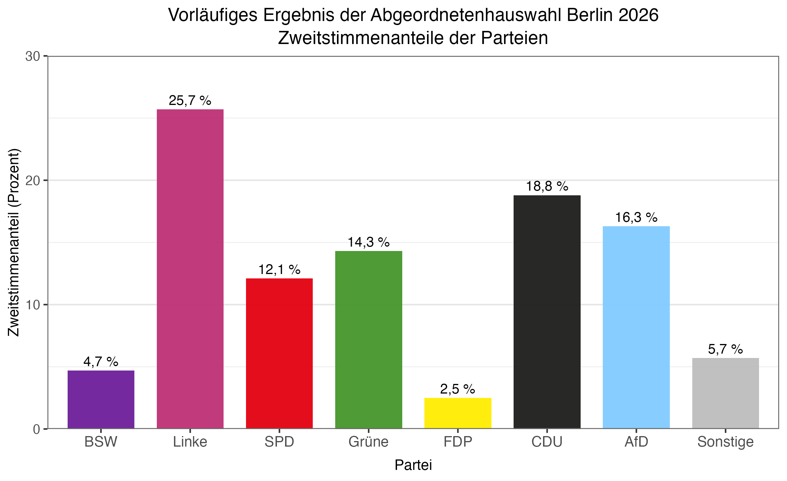
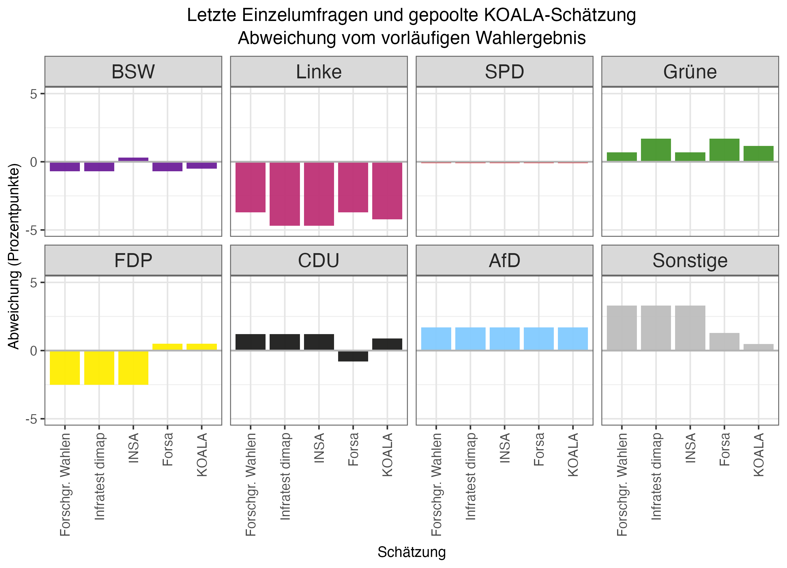
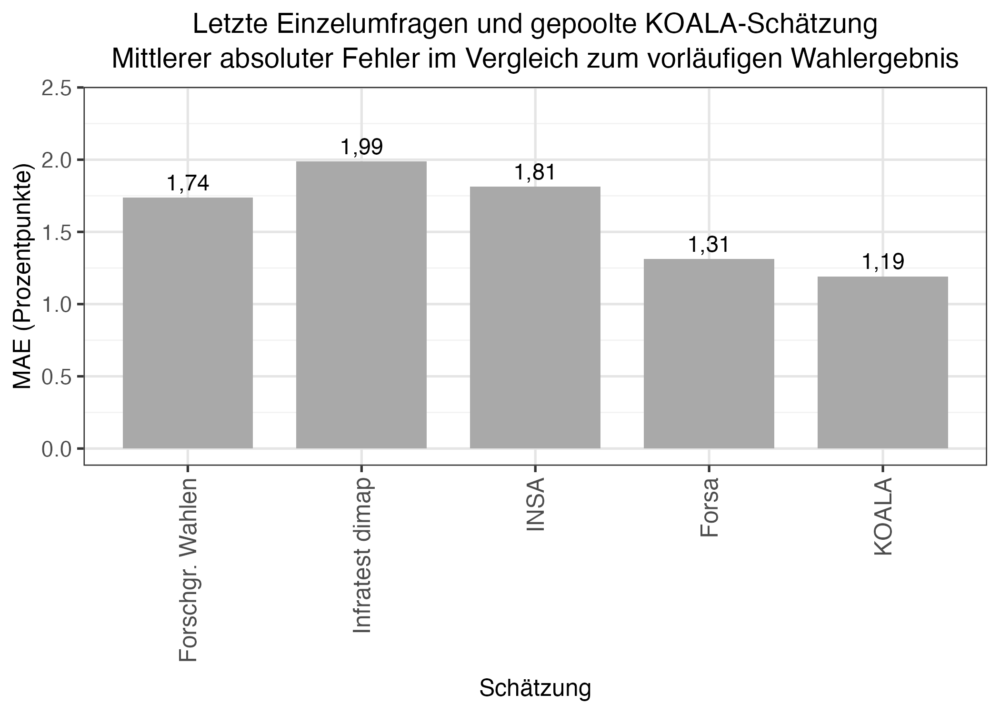

```{=html}
<header class="koala-site-header">
  <nav class="koala-site-nav" aria-label="Hauptnavigation">
    <a class="koala-site-brand" href="../../index.html#überblick">
      
      <span>Koalitionswahrscheinlichkeitsrechner LMU</span>
    </a>
    <div class="koala-site-links">
      <a href="../../index.html#überblick">Überblick</a>
      <a href="../../index.html#sitzverteilung">Sitzverteilung</a>
      <a href="../../index.html#zeitverlauf">Zeitverlauf</a>
      <a href="../../index.html#umfragedaten">Umfragedaten</a>
      <a class="active" href="../../index.html#blog" aria-current="page">Blog</a>
      <a href="../../index.html#methodik">Methodik</a>
      <a href="../../index.html#über-das-projekt">Über das Projekt</a>
    </div>
  </nav>
</header>
```

[Zurück zur Blogübersicht](../../index.html#blog){.back-link}

Die Abgeordnetenhauswahl in Berlin fand am 20. September 2026 statt. Für den Vergleich verwenden wir die jeweils letzte vor der Wahl veröffentlichte Umfrage von vier Instituten; ihre Veröffentlichungsdaten liegen zwischen dem 22. August und dem 18. September. Hinzu kommt die letzte gepoolte KOALA-Schätzung vom 18. September.

<details class="pooled-explainer">
<summary>Was ist eine gepoolte Umfrage?</summary>
<p>Die <em>gepoolte Umfrage</em> ist keine zusätzliche Befragung, sondern eine gemeinsame Schätzung auf Basis mehrerer Einzelumfragen. Berücksichtigt wird höchstens die jeweils jüngste Umfrage eines Instituts innerhalb des 100-Tage-Fensters. In den Punktschätzer gehen die Umfragen zunächst proportional zu ihrer ausgewiesenen Stichprobengröße ein; bei Umfragen, deren Veröffentlichung am Stichtag älter als 14 Tage ist, werden Stichprobengröße und Stimmenzahlen halbiert. Im letzten Pool erhielten daher die Umfragen von INSA, Forschungsgruppe Wahlen und Infratest dimap volles Gewicht, die Forsa-Umfrage vom 22. August halbes Gewicht. Nicht ausgewiesene Werte optionaler Parteien werden für das Pooling anhand einer früheren positiven Angabe ergänzt und von der Kategorie „Sonstige“ abgezogen. Bei der Berechnung der Unsicherheit wird außerdem angenommen, dass die Ergebnisse verschiedener Institute mit 0,5 korreliert sind. Das Pooling glättet zufällige Unterschiede zwischen Einzelumfragen, beseitigt aber weder gemeinsame Messfehler noch systematische Verzerrungen.</p>
</details>

## Datengrundlage

::: {.table-wrap .table-compact}

| Schätzung | Datum |
|---|---|
| INSA | 18. September 2026 |
| Forschungsgruppe Wahlen | 17. September 2026 |
| Infratest dimap | 10. September 2026 |
| Forsa | 22. August 2026 |
| KOALA-Pool | 18. September 2026 |

:::

Als Vergleichsmaßstab verwenden wir das von Wahlrecht ausgewiesene vorläufige Zweitstimmenergebnis auf Landesebene. Kleinere, im KOALA-Modell nicht einzeln geführte Parteien werden für alle Vergleiche zur Kategorie „Sonstige“ mit 5,7 Prozent zusammengefasst. Ein in einer Einzelumfrage nicht ausgewiesener Wert wird im direkten Vergleich als null dargestellt, wenn sich die übrigen veröffentlichten Kategorien bereits zu 100 Prozent summieren.

{#fig-election-result width="100%"}

## Umfragen im Vergleich

Die folgende Abbildung zeigt die Differenz zwischen Schätzung und Wahlergebnis in Prozentpunkten. Positive Werte stehen für eine Überschätzung, negative Werte für eine Unterschätzung.

{#fig-differences width="100%"}

Besonders auffällig ist die Linke: Ihr vorläufiges Ergebnis wurde von allen vier Einzelumfragen um 3,7 bis 4,7 Prozentpunkte unterschätzt. Die AfD wurde dagegen in allen vier Umfragen um 1,7 Prozentpunkte überschätzt. Bei der SPD lagen die letzten Punktschätzungen mit jeweils 12 Prozent nur 0,1 Prozentpunkte unter dem Ergebnis. Grüne und CDU wurden mit Ausnahme der älteren Forsa-Schätzung für die CDU ebenfalls leicht überschätzt. Beim BSW lagen die Umfragen mit 4 bis 5 Prozent nah am Ergebnis von 4,7 Prozent: INSA überschätzte es um 0,3 Prozentpunkte, die drei anderen Institute unterschätzten es jeweils um 0,7 Prozentpunkte. Die FDP wurde nur von Forsa separat ausgewiesen; dessen Schätzung von 3 Prozent lag 0,5 Prozentpunkte über dem Ergebnis. Bei den drei übrigen Umfragen führt die oben erläuterte Behandlung der nicht ausgewiesenen FDP als null dagegen zu einer Unterschätzung um jeweils 2,5 Prozentpunkte.

Die gepoolte KOALA-Schätzung zeigt dasselbe grundlegende Muster. Sie lag bei der Linken um 4,2 Prozentpunkte zu niedrig und bei der AfD um 1,7 Prozentpunkte zu hoch. Grüne und CDU wurden um 1,2 beziehungsweise 0,9 Prozentpunkte überschätzt. Bei FDP, BSW, „Sonstige“ und SPD betrugen die absoluten Abweichungen jeweils höchstens 0,5 Prozentpunkte.

Warum die Abweichungen zwischen den Umfrageinstituten teilweise so ähnlich ausfallen, lässt sich aus den veröffentlichten Zahlen nicht ablesen. Mögliche Gründe sind unentschiedene Wählende, Meinungsänderungen kurz vor der Wahl, Unterschiede zwischen den erreichten Befragten und den tatsächlichen Wählerinnen und Wählern oder falsche methodische Annahmen bei Gewichtung und Hochrechnung. Das ist allerdings Spekulation: Wie die Institute ihre Rohdaten im Einzelnen aufbereiten und gewichten, ist nicht vollständig öffentlich bekannt. Sind mehrere Umfragen systematisch in dieselbe Richtung verzerrt, kann unser Pooling das nicht ausgleichen. Die KOALA-Schätzung kann also nur so gut sein wie die Umfragen, auf denen sie beruht.

## Gesamtvergleich mit dem MAE

Für einen kompakten Gesamtvergleich verwenden wir den mittleren absoluten Fehler (MAE). Dafür berechnen wir in Prozentpunkten den absoluten Abstand zwischen Schätzung und Wahlergebnis und mitteln ihn gleichgewichtet über dieselben acht Kategorien, einschließlich „Sonstige“. Ein niedrigerer Wert bedeutet hier lediglich eine im Mittel kleinere Abweichung der jeweiligen Punktschätzung. Der MAE enthält keine Aussage über statistische Signifikanz oder Prognoseunsicherheit; zudem sind die acht Abweichungen nicht unabhängig, weil sich die Stimmenanteile jeweils zu ungefähr 100 Prozent summieren.

{#fig-mae width="82%"}

In diesem deskriptiven Vergleich hat KOALA mit 1,19 Prozentpunkten den niedrigsten MAE. Es folgen Forsa mit 1,31, die Forschungsgruppe Wahlen mit 1,74, INSA mit 1,81 und Infratest dimap mit 1,99 Prozentpunkten. Die letzte berücksichtigte Forsa-Umfrage war allerdings bereits 29 Tage vor der Wahl erschienen. Die Werte vergleichen deshalb nicht die Institute unter identischen zeitlichen Bedingungen.

## Mehrheits- und Hürdenwahrscheinlichkeiten

Betrachtet man die veröffentlichten Wahlumfragen probabilistisch, war eine Sitzmehrheit für Linke, SPD und Grüne nach dem Modell sehr wahrscheinlich. Ausgehend von der gepoolten KOALA-Schätzung ergab sich dafür eine Wahrscheinlichkeit von 99,9 Prozent. Genauso hoch war die Wahrscheinlichkeit, dass diese Kombination zugleich eine minimale Sitzmehrheit bildet. Eine minimale Sitzmehrheit liegt vor, wenn das Bündnis eine Mehrheit erreicht, aber keine kleinere Teilkoalition aus seinen Parteien bereits über genügend Sitze verfügt.

Im vorläufigen Wahlergebnis kamen Linke, SPD und Grüne auf 95 der 158 Sitze und überschritten damit die erforderlichen 80 Sitze deutlich. Keine Zweierkombination aus den drei Parteien verfügt allein über eine Mehrheit.

Auch für CDU, SPD und Grüne ergab sich mit 98,2 Prozent eine hohe modellbasierte Wahrscheinlichkeit für eine minimale Sitzmehrheit. Im vorläufigen Ergebnis kommen diese drei Parteien gemeinsam auf 82 Sitze und damit auf eine Mehrheit von zwei Sitzen.

Die Modellrechnungen verwenden die gesetzliche Regelgröße von 130 Sitzen und eine Mehrheitsschwelle von 66 Sitzen. Das vorläufige Wahlergebnis umfasst infolge von Überhang- und Ausgleichsmandaten hingegen 158 Sitze; für die Einordnung des tatsächlichen Ergebnisses gilt deshalb die Schwelle von 80 Sitzen. Die Wahrscheinlichkeiten sind folglich keine Vorhersage der Größe des vergrößerten Abgeordnetenhauses.

Unsicherheit bestand vor allem bei der Fünfprozenthürde. Das BSW lag in der gepoolten KOALA-Schätzung bei 4,2 Prozent. Daraus ergab sich eine modellbasierte Wahrscheinlichkeit von 7,2 Prozent, mindestens fünf Prozent der Stimmen zu erreichen. Im vorläufigen Ergebnis verfehlte es den Einzug mit 4,7 Prozent knapp. Für die FDP lag die auf eine Nachkommastelle gerundete Hürdenwahrscheinlichkeit bei 0,0 Prozent; sie blieb mit 2,5 Prozent ebenfalls außerhalb des Abgeordnetenhauses. Der gerundete Wert bedeutet nicht, dass das Überschreiten der Hürde grundsätzlich unmöglich war, sondern dass es in keiner der 10.000 Simulationen auftrat.

## Quellen

- [Wahlumfragen zur Abgeordnetenhauswahl in Berlin](https://www.wahlrecht.de/umfragen/landtage/berlin.htm) (Stand: 23. September 2026)
- [Vorläufiges Ergebnis der Abgeordnetenhauswahl in Berlin](https://www.wahlrecht.de/news/2026/abgeordnetenhauswahl-berlin-2026.html) (Stand: 23. September 2026)
- [Ergebnisse der Abgeordnetenhauswahlen in Berlin](https://www.wahlrecht.de/ergebnisse/berlin.htm) (Stand: 23. September 2026)
