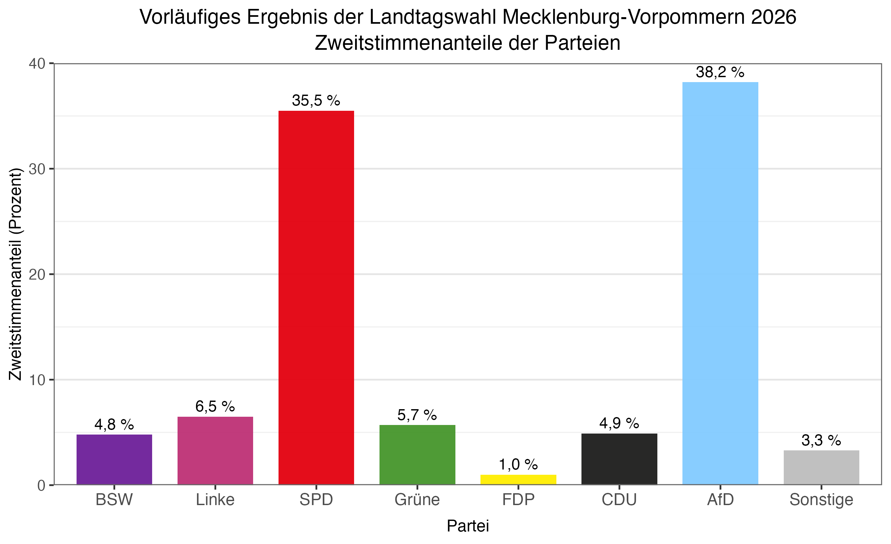
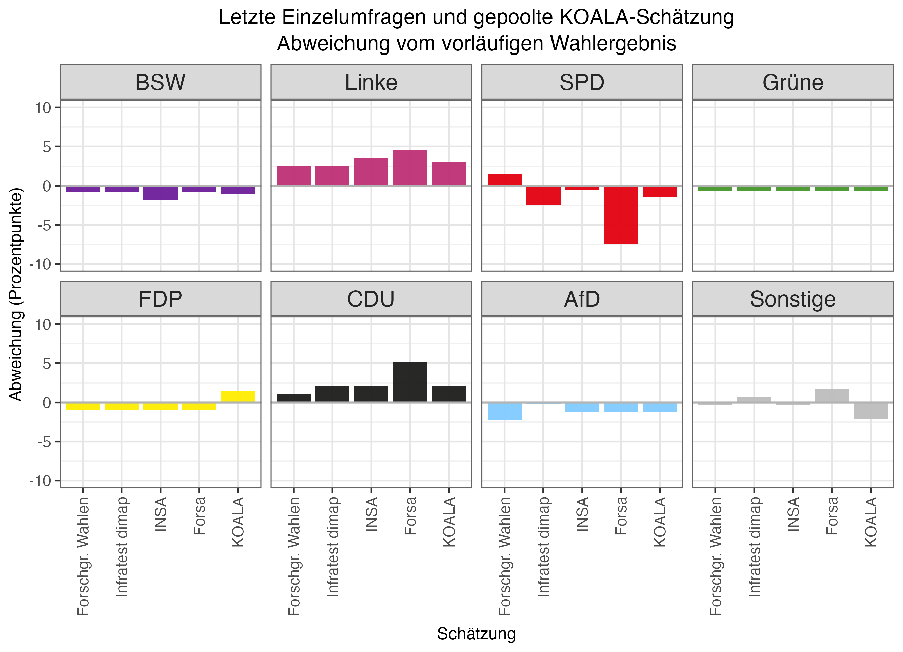
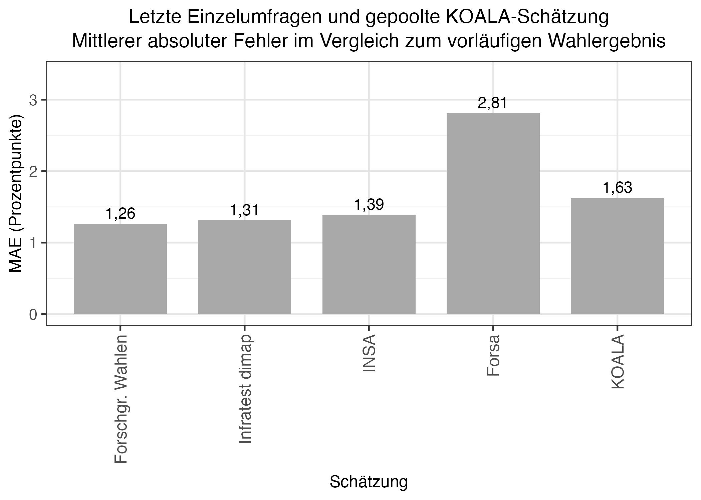

```{=html}
<header class="koala-site-header">
  <nav class="koala-site-nav" aria-label="Hauptnavigation">
    <a class="koala-site-brand" href="../../index.html#überblick">
      
      <span>Koalitionswahrscheinlichkeitsrechner LMU</span>
    </a>
    <div class="koala-site-links">
      <a href="../../index.html#überblick">Überblick</a>
      <a href="../../index.html#sitzverteilung">Sitzverteilung</a>
      <a href="../../index.html#zeitverlauf">Zeitverlauf</a>
      <a href="../../index.html#umfragedaten">Umfragedaten</a>
      <a class="active" href="../../index.html#blog" aria-current="page">Blog</a>
      <a href="../../index.html#methodik">Methodik</a>
      <a href="../../index.html#über-das-projekt">Über das Projekt</a>
    </div>
  </nav>
</header>
```

[Zurück zur Blogübersicht](../../index.html#blog){.back-link}

Die Landtagswahl in Mecklenburg-Vorpommern fand am 20. September 2026 statt. Für den Vergleich verwenden wir die jeweils letzte vor der Wahl veröffentlichte Umfrage der vier im KOALA-Modell berücksichtigten Institute; ihre Veröffentlichungsdaten liegen zwischen dem 2. und dem 17. September. Hinzu kommt die letzte gepoolte KOALA-Schätzung vom 17. September.

<details class="pooled-explainer">
<summary>Was ist eine gepoolte Umfrage?</summary>
<p>Die <em>gepoolte Umfrage</em> ist keine zusätzliche Befragung, sondern eine gemeinsame Schätzung auf Basis mehrerer Einzelumfragen. Berücksichtigt wird höchstens die jeweils jüngste Umfrage eines Instituts innerhalb des 100-Tage-Fensters. In den Punktschätzer gehen die Umfragen zunächst proportional zu ihrer ausgewiesenen Stichprobengröße ein; bei Umfragen, deren Veröffentlichung am Stichtag älter als 14 Tage ist, werden Stichprobengröße und Stimmenzahlen halbiert. Im letzten Pool erhielten daher die Umfragen von Forschungsgruppe Wahlen, INSA und Infratest dimap volles Gewicht, die Forsa-Umfrage vom 2. September halbes Gewicht. Nicht ausgewiesene Werte optionaler Parteien werden für das Pooling anhand einer früheren positiven Angabe ergänzt und von der Kategorie „Sonstige“ abgezogen. Bei der Berechnung der Unsicherheit wird außerdem angenommen, dass die Ergebnisse verschiedener Institute mit 0,5 korreliert sind. Das Pooling glättet zufällige Unterschiede zwischen Einzelumfragen, beseitigt aber weder gemeinsame Messfehler noch systematische Verzerrungen.</p>
</details>

## Datengrundlage

::: {.table-wrap .table-compact}

| Schätzung | Datum |
|---|---|
| Forschungsgruppe Wahlen | 17. September 2026 |
| INSA | 16. September 2026 |
| Infratest dimap | 10. September 2026 |
| Forsa | 2. September 2026 |
| KOALA-Pool | 17. September 2026 |

:::

Als Vergleichsmaßstab verwenden wir das von Wahlrecht ausgewiesene vorläufige Zweitstimmenergebnis auf Landesebene. Wahlrecht führt die Piraten mit 0,2 Prozent und die übrigen Parteien mit zusammen 3,1 Prozent getrennt auf. Da die Piraten im KOALA-Modell nicht als eigene Partei geführt werden, fassen wir beide Werte für alle Vergleiche zur Kategorie „Sonstige“ mit 3,3 Prozent zusammen.

Die am 10. September veröffentlichte Pollytix-Umfrage ist in der Modellkonfiguration für Mecklenburg-Vorpommern nicht als poolendes Institut hinterlegt. Sie geht deshalb nicht als eigenständige Umfrage in die KOALA-Schätzung oder den folgenden Institutsvergleich ein. Einzelne zuvor veröffentlichte Parteianteile aus den Rohdaten können jedoch als historische Referenz für die Ergänzung fehlender Werte im Pooling dienen.

Für nicht ausgewiesene FDP-Werte gelten in den beiden Vergleichen unterschiedliche Regeln. Im direkten Institutsvergleich wird ein fehlender FDP-Wert als null dargestellt, da sich die jeweils veröffentlichten Kategorien bereits zu 100 Prozent summieren. Für die KOALA-Schätzung wird dagegen der letzte zuvor veröffentlichte positive FDP-Wert ergänzt und derselbe Anteil von der Kategorie „Sonstige“ abgezogen. Dadurch bleibt die FDP im Pool als eigene Partei enthalten; der ergänzte Wert ist aber keine neue Beobachtung des jeweiligen Instituts.

{#fig-election-result width="100%"}

## Umfragen im Vergleich

Die folgende Abbildung zeigt die Differenz zwischen Schätzung und Wahlergebnis in Prozentpunkten. Positive Werte stehen für eine Überschätzung, negative Werte für eine Unterschätzung.

{#fig-differences width="100%"}

Besonders einheitlich ist das Bild bei der Linken: Ihr vorläufiges Ergebnis wurde von allen vier Einzelumfragen um 2,5 bis 4,5 Prozentpunkte überschätzt. Auch die CDU wurde durchgehend überschätzt, und zwar um 1,1 bis 5,1 Prozentpunkte. Umgekehrt lag die AfD in allen vier Umfragen unter ihrem späteren Ergebnis; die Abweichungen reichen von 0,2 bis 2,2 Prozentpunkten.

Bei der SPD unterscheiden sich die Schätzungen deutlich, wobei ihr Veröffentlichungszeitpunkt für die Einordnung wichtig ist. Forsa wies am 2. September 28 Prozent aus und unterschätzte das Ergebnis damit um 7,5 Prozentpunkte. Diese Umfrage erschien bereits 18 Tage vor der Wahl. In den später veröffentlichten Umfragen stieg der ausgewiesene SPD-Anteil auf 33 Prozent bei Infratest dimap, 35 Prozent bei INSA und 37 Prozent bei der Forschungsgruppe Wahlen; ihre Abweichungen betrugen damit minus 2,5, minus 0,5 und plus 1,5 Prozentpunkte. Die zeitliche Abfolge spricht dafür, dass die ältere Forsa-Schätzung die Entwicklung in den letzten Wahlkampfwochen nicht mehr abbilden konnte.

Auch bei den übrigen Parteien zeigt sich ein recht klares Muster. Das BSW wurde in allen vier Umfragen unterschätzt: dreimal um 0,8 und von INSA um 1,8 Prozentpunkte. Die Grünen wurden durchgehend mit 5 Prozent ausgewiesen und lagen damit jeweils 0,7 Prozentpunkte unter ihrem Ergebnis. Die FDP wurde in keiner der vier Umfragen separat ausgewiesen; nach der oben erläuterten Null-Konvention ergibt sich gegenüber ihrem Ergebnis von 1 Prozent jeweils eine Unterschätzung um 1 Prozentpunkt. Bei den „Sonstigen“ reichten die Schätzungen von 3 bis 5 Prozent und damit von einer Unterschätzung um 0,3 bis zu einer Überschätzung um 1,7 Prozentpunkte.

Die gepoolte KOALA-Schätzung zeigt dasselbe grundlegende Muster. Sie lag bei der Linken um 3,0 und bei der CDU um 2,1 Prozentpunkte zu hoch. Die Kategorie „Sonstige“, SPD, AfD, BSW und Grüne wurden um 2,2, 1,4, 1,2, 1,0 beziehungsweise 0,7 Prozentpunkte unterschätzt. Für die FDP wies KOALA auf Grundlage der beschriebenen Ergänzung rund 2,5 Prozent aus. Gegenüber dem Wahlergebnis von 1,0 Prozent entspricht das einer Überschätzung um rund 1,5 Prozentpunkte. Keine der vier letzten berücksichtigten Einzelumfragen hatte die FDP separat ausgewiesen; der KOALA-Wert beruht hier deshalb wesentlich auf der Modellannahme zur Ergänzung fehlender Parteianteile.

Warum die Abweichungen zwischen den Umfrageinstituten teilweise so ähnlich ausfallen, lässt sich aus den veröffentlichten Zahlen nicht ablesen. Mögliche Gründe sind unentschiedene Wählende, Meinungsänderungen kurz vor der Wahl, Unterschiede zwischen den erreichten Befragten und den tatsächlichen Wählerinnen und Wählern oder falsche methodische Annahmen bei Gewichtung und Hochrechnung. Das ist allerdings Spekulation: Wie die Institute ihre Rohdaten im Einzelnen aufbereiten und gewichten, ist nicht vollständig öffentlich bekannt. Sind mehrere Umfragen systematisch in dieselbe Richtung verzerrt, kann unser Pooling das nicht ausgleichen. Die KOALA-Schätzung kann also nur so gut sein wie die Umfragen, auf denen sie beruht.

## Gesamtvergleich mit dem MAE

Für einen kompakten Gesamtvergleich verwenden wir den mittleren absoluten Fehler (MAE). Dafür berechnen wir in Prozentpunkten den absoluten Abstand zwischen Schätzung und Wahlergebnis und mitteln ihn gleichgewichtet über dieselben acht Kategorien, einschließlich „Sonstige“. Ein niedrigerer Wert bedeutet hier lediglich eine im Mittel kleinere Abweichung der jeweiligen Punktschätzung. Der MAE enthält keine Aussage über statistische Signifikanz oder Prognoseunsicherheit; zudem sind die acht Abweichungen nicht unabhängig, weil sich die Stimmenanteile jeweils zu ungefähr 100 Prozent summieren.

{#fig-mae width="82%"}

In diesem deskriptiven Vergleich hat die Forschungsgruppe Wahlen mit 1,26 Prozentpunkten den niedrigsten MAE. Es folgen Infratest dimap mit 1,31, INSA mit 1,39 und KOALA mit 1,63 Prozentpunkten. Forsa liegt bei 2,81 Prozentpunkten; dessen letzte berücksichtigte Umfrage war allerdings bereits 18 Tage vor der Wahl erschienen. Die Werte vergleichen deshalb nicht die Institute unter identischen zeitlichen Bedingungen.

## Mehrheits- und Hürdenwahrscheinlichkeiten

Betrachtet man die veröffentlichten Wahlumfragen probabilistisch, bestand Unsicherheit darüber, ob SPD, Linke und Grüne gemeinsam eine Sitzmehrheit erreichen würden. Ausgehend von der gepoolten KOALA-Schätzung ergab sich dafür eine modellbasierte Wahrscheinlichkeit von 69,2 Prozent. Die Wahrscheinlichkeit, dass diese Kombination zugleich eine minimale Sitzmehrheit bildet, lag bei 48,5 Prozent. Eine minimale Sitzmehrheit liegt vor, wenn das Bündnis eine Mehrheit erreicht, aber keine kleinere Teilkoalition aus seinen Parteien bereits über genügend Sitze verfügt.

Im vorläufigen Wahlergebnis kamen die drei Parteien auf 39 der 71 Sitze und überschritten damit die erforderlichen 36 Sitze. Die Kombination bildet zugleich eine minimale Sitzmehrheit: SPD und Linke sowie SPD und Grüne kommen jeweils auf 34 Sitze, Linke und Grüne gemeinsam auf zehn.

Für eine absolute Sitzmehrheit der AfD ergab sich nach der KOALA-Methode eine auf eine Nachkommastelle gerundete Wahrscheinlichkeit von 0,0 Prozent. Im vorläufigen Ergebnis erhielt die AfD 32 Sitze und verfehlte die absolute Mehrheit damit um vier Sitze.

Besonders deutlich zeigt sich die verbleibende Unsicherheit an der Fünf-Prozent-Hürde. Die CDU lag in der gepoolten KOALA-Schätzung bei 7,0 Prozent. In allen 10.000 Simulationen erreichte sie mindestens fünf Prozent; im vorläufigen Ergebnis blieb sie mit 4,9 Prozent dennoch knapp unter der Hürde und erhielt keine Sitze. Ein simulierter Wert von 100,0 Prozent bedeutet nicht, dass ein anderes Ergebnis grundsätzlich unmöglich war, sondern nur, dass es unter den Modellannahmen in den gezogenen Simulationen nicht auftrat.

Die Grünen lagen in der gepoolten Schätzung genau bei 5,0 Prozent. Daraus ergab sich eine modellbasierte Hürdenwahrscheinlichkeit von 50,0 Prozent. Tatsächlich zogen sie mit 5,7 Prozent und fünf Sitzen in den Landtag ein. Das BSW wurde im Pool mit 3,8 Prozent unterhalb der Hürde verortet; seine Wahrscheinlichkeit, sie dennoch zu überwinden, lag bei 1,5 Prozent. Im vorläufigen Ergebnis verfehlte es den Einzug mit 4,8 Prozent knapp. Für die FDP lag die gerundete Hürdenwahrscheinlichkeit bei 0,0 Prozent; sie erreichte 1,0 Prozent.

## Quellen

- [Wahlumfragen zur Landtagswahl in Mecklenburg-Vorpommern](https://www.wahlrecht.de/umfragen/landtage/mecklenburg-vorpommern.htm) (Stand: 23. September 2026)
- [Ergebnisse der Landtagswahl in Mecklenburg-Vorpommern](https://www.wahlrecht.de/ergebnisse/mecklenburg.htm) (Stand: 23. September 2026)
