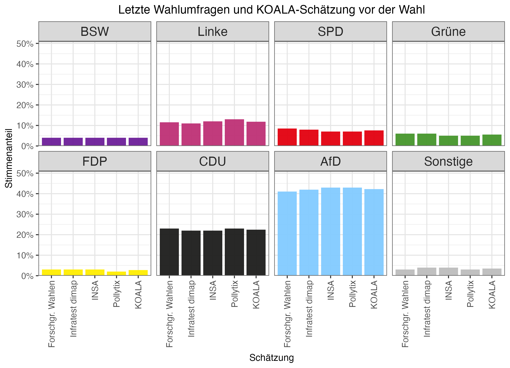
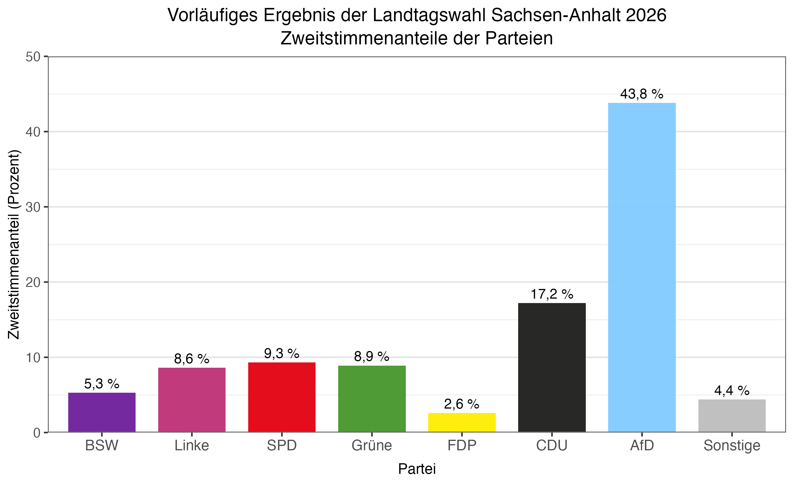
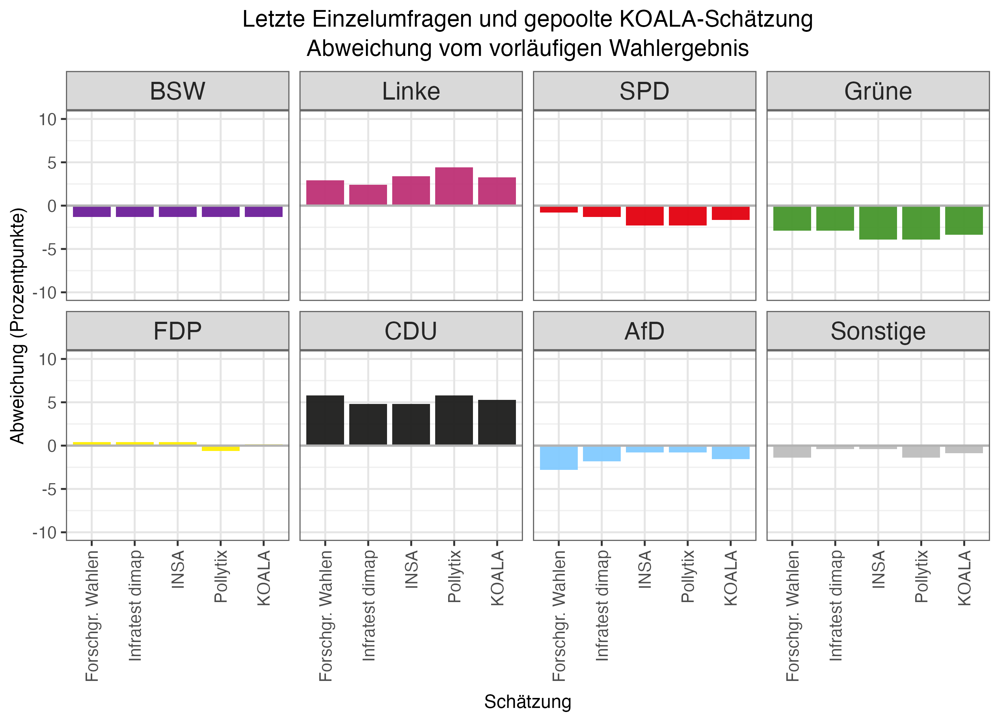
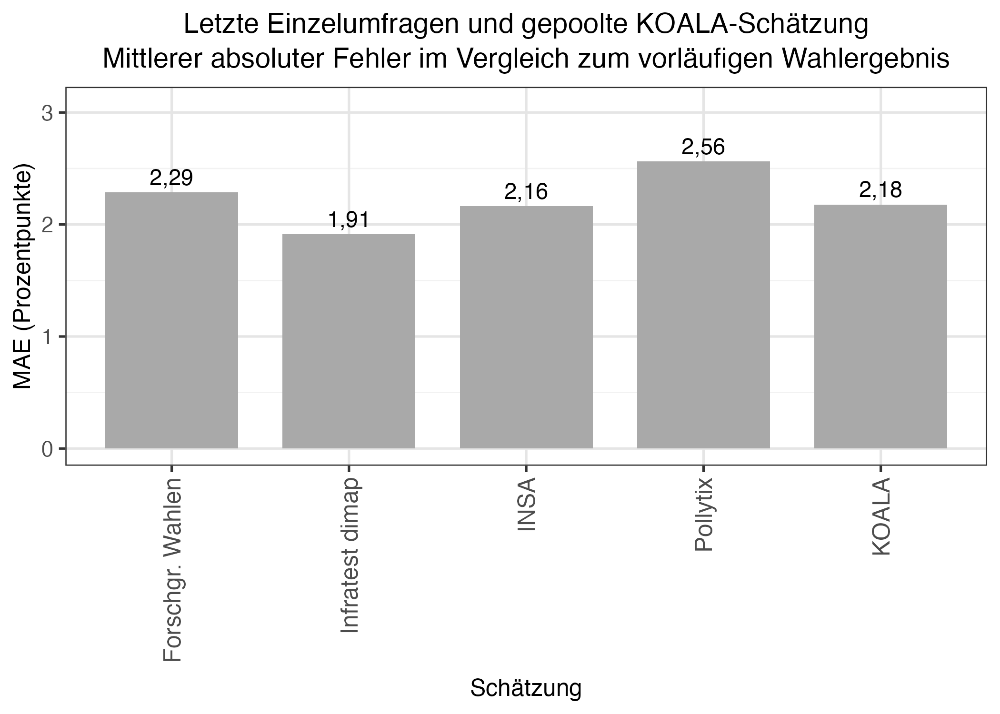

[Zurück zur Blogübersicht](../../index.html#blog){.back-link}

Die Landtagswahl in Sachsen-Anhalt fand am 6. September 2026 statt. Für den Vergleich verwenden wir die jeweils letzte vor der Wahl veröffentlichte Umfrage von vier Instituten; ihre Veröffentlichungsdaten liegen zwischen dem 12. August und dem 3. September. Hinzu kommt die letzte gepoolte KOALA-Schätzung vom 3. September.

Was ist eine gepoolte Umfrage?

Die <em>gepoolte Umfrage</em> ist keine zusätzliche Befragung, sondern ein gemeinsamer Punktschätzer aus mehreren Einzelumfragen. Berücksichtigt wird höchstens die jeweils jüngste Umfrage eines Instituts innerhalb des 100-Tage-Fensters. Die Stimmenanteile werden nach der ausgewiesenen Stichprobengröße gewichtet; bei Umfragen, deren Veröffentlichung am Stichtag älter als 14 Tage ist, werden die rechnerische Stichprobengröße und damit das Gewicht halbiert. Im letzten Pool erhielten daher die Umfragen von Forschungsgruppe Wahlen, INSA und Infratest dimap volles Gewicht, die Pollytix-Umfrage vom 12. August halbes Gewicht. Das Pooling glättet zufällige Unterschiede zwischen Einzelumfragen, beseitigt aber weder gemeinsame Messfehler noch systematische Verzerrungen.

## Datengrundlage

::: {.table-wrap .table-compact}

| Schätzung | Datum |
|---|---|
| Forschungsgruppe Wahlen | 3. September 2026 |
| INSA | 2. September 2026 |
| Infratest dimap | 26. August 2026 |
| Pollytix | 12. August 2026 |
| KOALA-Pool | 3. September 2026 |

:::

Die folgende Abbildung zeigt die jeweils letzte veröffentlichte Wahlumfrage der vier Institute sowie die letzte gepoolte KOALA-Schätzung vor der Wahl.

{#fig-latest-polls width="100%"}

Als Vergleichsmaßstab verwenden wir das von Wahlrecht ausgewiesene vorläufige Zweitstimmenergebnis auf Landesebene. Wahlrecht führt die Freien Wähler mit 1,2 Prozent und die übrigen Parteien mit zusammen 3,2 Prozent getrennt auf. Da die Freien Wähler im KOALA-Modell nicht als eigene Partei geführt werden, fassen wir beide Werte für alle Vergleiche zur Kategorie „Sonstige“ mit 4,4 Prozent zusammen.

{#fig-election-result width="100%"}

## Umfragen im Vergleich

Die folgende Abbildung zeigt die Differenz zwischen Schätzung und Wahlergebnis in Prozentpunkten. Positive Werte stehen für eine Überschätzung, negative Werte für eine Unterschätzung.

{#fig-differences width="100%"}

Besonders auffällig ist die CDU: Ihr vorläufiges Ergebnis wurde von allen fünf Schätzungen um 4,8 bis 5,8 Prozentpunkte überschätzt. Auch das Ergebnis der Linken wurde durchgehend überschätzt, und zwar um 2,4 bis 4,4 Prozentpunkte. Umgekehrt wurden die Grünen in allen Schätzungen um 2,9 bis 3,9 Prozentpunkte unterschätzt. Bei der FDP und der Kategorie „Sonstige“ waren die absoluten Abweichungen kleiner.

Die gepoolte KOALA-Schätzung zeigt dasselbe grundlegende Muster. Sie lag bei der CDU um 5,3 Prozentpunkte und bei der Linken um 3,2 Prozentpunkte zu hoch. Grüne, SPD, AfD und BSW wurden um 3,4, 1,7, 1,5 beziehungsweise 1,3 Prozentpunkte unterschätzt.

## Gesamtvergleich mit dem MAE

Für einen kompakten Gesamtvergleich verwenden wir den mittleren absoluten Fehler (MAE). Dafür berechnen wir in Prozentpunkten den absoluten Abstand zwischen Schätzung und Wahlergebnis und mitteln ihn gleichgewichtet über dieselben acht Kategorien, einschließlich „Sonstige“. Ein niedrigerer Wert bedeutet hier lediglich eine im Mittel kleinere Abweichung der jeweiligen Punktschätzung. Der MAE enthält keine Aussage über statistische Signifikanz oder Prognoseunsicherheit; zudem sind die acht Abweichungen nicht unabhängig, weil sich die Stimmenanteile jeweils zu ungefähr 100 Prozent summieren.

{#fig-mae width="82%"}

In diesem deskriptiven Vergleich hat Infratest dimap mit 1,91 Prozentpunkten den niedrigsten MAE. Es folgen INSA mit 2,16, KOALA mit 2,18 und die Forschungsgruppe Wahlen mit 2,29 Prozentpunkten. Pollytix liegt bei 2,56 Prozentpunkten; dessen letzte berücksichtigte Umfrage war allerdings bereits 25 Tage vor der Wahl erschienen. Die Werte vergleichen deshalb nicht die Institute unter identischen zeitlichen Bedingungen.

## Koalitions- und Hürdenwahrscheinlichkeiten

Betrachtet man die veröffentlichten Wahlumfragen probabilistisch, bestand Unsicherheit darüber, ob CDU, Linke, SPD und Grüne gemeinsam eine Sitzmehrheit erreichen würden. Ausgehend von der gepoolten KOALA-Schätzung ergab sich dafür eine modellbasierte Wahrscheinlichkeit von 87,7 Prozent. Die Wahrscheinlichkeit, dass diese Kombination zugleich eine minimale Sitzmehrheit bildet, lag bei 79,5 Prozent. Eine minimale Sitzmehrheit liegt vor, wenn das Bündnis eine Mehrheit erreicht, aber keine kleinere Teilkoalition aus seinen Parteien bereits über genügend Sitze verfügt.

Im vorläufigen Wahlergebnis kamen die vier Parteien jedoch nur auf 44,0 Prozent der Stimmen und 39 der 83 Sitze. Damit verfehlten sie die erforderlichen 42 Sitze. Der Unterschied zum Wahlergebnis ist vor allem auf die Überschätzung der Stimmenanteile der CDU und der Linken zurückzuführen.

Für eine absolute Sitzmehrheit der AfD ergab sich nach der KOALA-Methode eine Wahrscheinlichkeit von 10,3 Prozent. Im vorläufigen Ergebnis erhielt die AfD 39 Sitze und verfehlte damit ebenfalls die absolute Mehrheit.

Unsicherheit bestand auch darüber, welche Parteien die Fünfprozenthürde überwinden würden. Die Grünen lagen in der gepoolten KOALA-Schätzung bei 5,5 Prozent. Daraus ergab sich eine modellbasierte Wahrscheinlichkeit von 81,1 Prozent, mindestens fünf Prozent der Stimmen zu erreichen. Im vorläufigen Wahlergebnis zogen sie mit 8,9 Prozent deutlich in den Landtag ein. Das BSW wurde in der gepoolten Schätzung mit 4,0 Prozent unterhalb der Hürde verortet. Seine Wahrscheinlichkeit, die Hürde dennoch zu überwinden, lag nach der KOALA-Methode bei 3,5 Prozent. Tatsächlich erreichte das BSW 5,3 Prozent, erhielt im vorläufigen Ergebnis fünf Sitze und zog damit in den Landtag ein.

Für die FDP lag die auf eine Nachkommastelle gerundete Hürdenwahrscheinlichkeit bei 0,0 Prozent. Im vorläufigen Ergebnis blieb sie mit 2,6 Prozent ebenfalls unter der Fünfprozenthürde. Der gerundete Wert bedeutet nicht, dass das Überschreiten der Hürde grundsätzlich unmöglich war, sondern dass ihm das Modell eine äußerst geringe Wahrscheinlichkeit zuwies.

## Quellen

- [Wahlumfragen zur Landtagswahl in Sachsen-Anhalt](https://www.wahlrecht.de/umfragen/landtage/sachsen-anhalt.htm)
- [Ergebnisse der Landtagswahl in Sachsen-Anhalt](https://www.wahlrecht.de/ergebnisse/sachsen-anhalt.htm)
