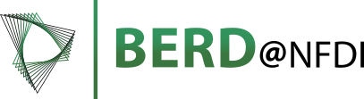

```{=html}
<style>
/* Header bar one shade down from Bootstrap's gray-100 default (#f8f9fa), so it
   reads as a distinct band against the white page body rather than blending
   into it. Cosmo sets this via the navbar's own background, hence !important. */
#quarto-dashboard-header .navbar {
  background-color: #e9ecef !important;
}

.card-body,
.card-body .html-fill-item,
.card-body .cell,
.card-body .cell-output-display {
  justify-content: flex-start !important;
  align-content: flex-start !important;
}

.card-body {
  padding-top: 0.5rem !important;
}

.card-body figure > h2 {
  font-size: 1.15rem !important;
}

.card-body figure > h3 {
  font-size: 0.95rem !important;
  margin-bottom: 16px !important;
}

/* Cards built from multiple ojs cells (via ::: {.card} fences) get one
   .cell.card-body wrapper per cell, stacked as flex siblings that each grow
   to an equal share of the card's height by default. Shrink every cell to
   its own content height instead, so leftover space collapses to the
   bottom of the card rather than sitting as a gap between cells. */
.zeitverlauf-card > .cell.card-body {
  flex: 0 0 auto !important;
}

/* The text-heavy Methodik and project cards need to scroll inside the card
   instead of being clipped on short viewports. */
.methodik-card > .cell.card-body,
.methodik-publications-card > .cell.card-body,
.projekt-card > .cell.card-body {
  overflow-y: auto !important;
}

/* The Überblick charts have fixed pixel heights, so rows sized as a fraction of
   the viewport shrink below their own chart and the card clips the x-axis. Floor
   each row at its content height (max-content, so it follows the charts); below
   that the main area scrolls. bslib sets the tracks inline, hence !important. */
#überblick > .bslib-grid {
  grid-template-rows: minmax(max-content, 55fr) minmax(max-content, 45fr) !important;
}

/* The scaffold around each ojs cell's hidden source stays a fill item, so on a
   card taller than its chart it takes a share of the space and pushes it down. */
.card-body > .code-copy-outer-scaffold {
  flex: 0 0 auto !important;
}

.card-body svg [aria-label="tick"] text {
  font-size: 13px;
}

.overview-coalitions svg [aria-label="y-axis tick"] text,
.overview-coalitions svg [aria-label="tick"] text {
  font-size: 14px;
}
</style>

<script>
// Plot writes its size into <svg width height> and emits no viewBox, so CSS alone
// can only crop a chart, never scale it — the fit rules in the stylesheet above do
// nothing until the viewBox exists. Adding one (0 0 width height, i.e. exactly the
// size Plot laid the chart out at) leaves the chart pixel-identical while it fits
// and scales it down proportionally once the card is too short.
//
// The crosshair overlays keep working on a scaled chart: they position via
// plot.scale(...) in user-space coordinates, which the viewBox maps, and read the
// pointer via d3.pointer(event, svg), which inverts the live screen CTM.
//
// OJS renders cells asynchronously and re-renders them whenever an input changes,
// so charts appear long after DOMContentLoaded — hence an observer instead of a
// one-shot pass. Elements that already carry a viewBox (Bootstrap icons) are left
// untouched.
(() => {
  const addViewBox = svg => {
    if (svg.hasAttribute("viewBox")) return
    const w = svg.getAttribute("width")
    const h = svg.getAttribute("height")
    if (!w || !h) return
    svg.setAttribute("viewBox", `0 0 ${w} ${h}`)
  }

  const scan = node => {
    if (node.nodeType !== Node.ELEMENT_NODE) return
    if (node.matches("svg[width][height]")) addViewBox(node)
    node.querySelectorAll("svg[width][height]").forEach(addViewBox)
  }

  new MutationObserver(records => {
    for (const record of records) record.addedNodes.forEach(scan)
  }).observe(document.documentElement, { childList: true, subtree: true })

  document.addEventListener("DOMContentLoaded", () => scan(document.body))
})()
</script>
```

```{r}
#| label: setup-locale
#| output: false
# Render environments (notably CI runners) can start R under the "C" locale,
# which has no UTF-8 codeset. Under that locale, R's own encoding-conversion
# machinery (enc2utf8(), and thus jsonlite::toJSON()/ojs_define()) cannot
# convert non-ASCII literals typed in this file (e.g. "Grüne") and silently
# corrupts them. Force a UTF-8 locale before anything else runs. This has to
# sit in its own chunk: R parses a whole chunk's source text upfront, so a
# locale change can't retroactively fix how literals *later in the same
# chunk* already got parsed — it only affects chunks parsed after it runs.
for (loc in c("en_US.UTF-8", "C.UTF-8", "en_US.utf8")) {
  if (tryCatch(Sys.setlocale("LC_CTYPE", loc), error = function(e) "") != "") break
}
```

```{r}
#| label: load-dashboard-data
#| output: false
# Only hand-written constants go through ojs_define. The data itself is read
# straight from data/ by the browser (see the election-files cell below):
# prepare_data.R already wrote it as JSON, so routing it through R would just
# parse it and serialise it back out — for the ~90 MB across all four elections
# that round trip costs minutes of render time and inlines every byte of it
# into index.html, which every visitor then downloads before anything appears.
ojs_define(
  # seat_method / hurdle / pooling_days mirror parliament$seat_allocation,
  # parliament$hurdle and pooling$period in config/elections/*.yml — the values
  # the nowcast actually runs with. Keep them in sync when a config changes;
  # the Methodik page states them as the method in use.
  election_meta = list(
    ST = list(
      title = "Landtagswahl in Sachsen-Anhalt 2026",
      seats = 83L,
      majority = 42L,
      last_election = "6. Juni 2021",
      next_election = "6. September 2026",
      seat_method = "Hare-Niemeyer",
      hurdle = "5 %",
      pooling_days = 14L
    ),
    MV = list(
      title = "Landtagswahl in Mecklenburg-Vorpommern 2026",
      seats = 71L,
      majority = 36L,
      last_election = "26. September 2021",
      next_election = "20. September 2026",
      seat_method = "Hare-Niemeyer",
      hurdle = "5 %",
      pooling_days = 14L
    ),
    BE = list(
      title = "Abgeordnetenhauswahl in Berlin 2026",
      seats = 130L,
      majority = 66L,
      last_election = "12. Februar 2023",
      next_election = "20. September 2026",
      seat_method = "Hare-Niemeyer",
      hurdle = "5 %",
      pooling_days = 14L
    ),
    BTW = list(
      title = "Bundestagswahl 2029",
      seats = 630L,
      majority = 316L,
      last_election = "23. Februar 2025",
      next_election = "26. Januar bis 25. März 2029, Termin offen",
      seat_method = "Sainte-Laguë/Schepers",
      hurdle = "5 %",
      pooling_days = 14L
    )
  ),
  party_colors = list(
    cdu = "#1c1c1b", spd = "#e3000f", afd = "#82caff",
    greens = "#46962b", fdp = "#ffed00", fw = "#005fa3",
    left = "#be3075", bsw = "#6d1f99", others = "#aaaaaa"
  ),
  party_names = list(
    cdu = "Union", spd = "SPD", afd = "AfD",
    greens = "Grüne", fdp = "FDP", fw = "Freie Wähler",
    left = "Linke", bsw = "BSW", others = "Sonstige"
  ),
  pollster_names = list(
    allensbach = "Institut für Demoskopie Allensbach",
    civey      = "Civey",
    emnid      = "Verian (Emnid)",
    forsa      = "Forsa",
    fgw        = "Forschungsgruppe Wahlen",
    gms        = "GMS",
    infratest  = "infratest dimap",
    insa       = "INSA"
  )
)
```

```{ojs}
//| label: ojs-setup
//| output: false
d3 = require("d3@7")
party_order = ["left", "spd", "bsw", "greens", "fdp", "fw", "cdu", "afd"]

label_to_party = Object.fromEntries(
  Object.entries(party_names).map(([party, label]) => [label, party])
)

party_to_label = Object.fromEntries(
  Object.entries(label_to_party).map(([label, party]) => [party, label])
)

coalitionParties = label =>
  label.split("-").map(label => label_to_party[label])

partyKey = parties =>
  parties.slice().sort().join("|")

normCoalition = label =>
  partyKey(coalitionParties(label))

labelFromParties = parties =>
  parties.map(party => party_to_label[party] || party).join("-")

// Year ticks for the two time-series x-axes. Plot's own ticks: "year" only
// emits January 1s that fall inside the domain, so a range shorter than a year
// (a fresh scrape, or a single-institute series with few polls) yields no tick
// at all and the axis loses its year label entirely. Fall back to the first
// date in that case, so the year is always shown.
yearTicks = (min, max) => {
  if (min == null || max == null) return []
  const years = d3.utcYears(d3.utcYear.ceil(min), max)
  return years.length ? years : [min]
}

// tickFormat must return a string: a number goes through Plot's locale-aware
// default number formatting, which renders the year as "2,026".
formatYear = d => String(d.getUTCFullYear())

// Every number shown to a reader goes through here: toFixed() is locale-blind
// and would print "11.7". Fixed digits keep a column's decimals aligned.
formatDe = (value, digits = 1) =>
  Number(value).toLocaleString("de-DE", {
    minimumFractionDigits: digits,
    maximumFractionDigits: digits
  })

// Ceiling for the Umfrageverlauf Stimmenanteil axes, per election: the derived
// domain runs to 40 % for the Bundestagswahl, where nothing has polled above 33.
// Per election because the state series really do reach the low 40s; an election
// absent here keeps its derived domain.
//
// Block with an explicit return rather than `= ({ BTW: 35 })`, for the same
// reason as election_files below: Quarto's OJS layer evaluates a cell whose body
// is a parenthesised object literal to undefined.
voteShareYCap = {
  return { BTW: 35 }
}

// Caps `derived`, but never below `dataMax` — a future poll above the cap widens
// the axis again rather than being drawn outside the frame.
capYMax = (derived, dataMax, election) => {
  const cap = voteShareYCap[election]
  return cap == null ? derived : Math.max(Math.min(derived, cap), dataMax)
}

// Coalitions that are mathematically possible but politically off the table —
// no party governs with AfD, and Linke is ruled out by BSW. FDP and CDU rule
// Linke out federally only: on Landtag level those two pairings are in play, so
// the Bundestagswahl carries them and the state elections do not.
//
// Block with an explicit return rather than a bare ternary, for the same reason
// as voteShareYCap above.
excludedPairs = {
  return election === "BTW"
    ? [["left", "fdp"], ["left", "cdu"], ["left", "bsw"]]
    : [["left", "bsw"]]
}

// The single exception to "no party governs with AfD": AfD and BSW on their own,
// which from here on is treated like any other coalition — no special display
// rule, so it surfaces wherever the usual thresholds let it. Only that exact
// pair, though: AfD with any other partner stays off the table, and so does
// AfD-BSW with a third party joined to it.
afdBswKey = "afd|bsw"

isViableCoalition = parties =>
  (!parties.includes("afd") || parties.length === 1 || partyKey(parties) === afdBswKey) &&
  !excludedPairs.some(([a, b]) => parties.includes(a) && parties.includes(b))

meanBy = (data, keyFn, valueFn) =>
  Array.from(
    d3.rollup(data, v => d3.mean(v, valueFn), keyFn),
    ([key, value]) => ({ key, value })
  )

cleanShares = (shares, includeOthers = false) => {
  return meanBy(
    shares.filter(d => includeOthers || d.party !== "others"),
    d => d.party,
    d => d.percent
  )
    .map(d => ({
      party: d.key,
      percent: d.value,
      label: party_names[d.key] || d.key
    }))
    .sort((a, b) => {
      const ai = party_order.indexOf(a.party)
      const bi = party_order.indexOf(b.party)
      return (ai === -1 ? Infinity : ai) - (bi === -1 ? Infinity : bi)
    })
}

cleanHurdles = hurdles => {
  return meanBy(
    hurdles.filter(d => d.party !== "others" && d.prob_above_hurdle < 1),
    d => d.party,
    d => d.prob_above_hurdle
  )
    .map(d => ({
      party: d.key,
      prob_above_hurdle: d.value,
      label: party_names[d.key] || d.key
    }))
    .sort((a, b) => b.prob_above_hurdle - a.prob_above_hurdle)
}

cleanCoalitions = (coalitions, shares) => {
  const partyVotes = Object.fromEntries(
    cleanShares(shares).map(d => [d.party, d.percent])
  )

  const byLabel = Array.from(
    d3.rollup(
      coalitions,
      v => d3.mean(v, d => d.probability),
      d => d.label
    ),
    ([label, probability]) => ({
      label,
      probability,
      parties: coalitionParties(label),
      coalition_key: normCoalition(label)
    })
  )

  return Array.from(
    d3.group(
      byLabel.filter(d => isViableCoalition(d.parties)),
      d => d.coalition_key
    ),
    ([coalition_key, rows]) => {
      rows.sort((a, b) =>
        d3.descending(a.probability, b.probability) ||
        d3.ascending(a.label, b.label)
      )

      const probability = d3.sum(rows, d => d.probability)
      const maxMemberVote = d3.max(rows[0].parties, p => partyVotes[p] ?? -Infinity)
      const label = rows
        .filter(d => (partyVotes[d.parties[0]] ?? -Infinity) === maxMemberVote)
        .sort((a, b) => d3.ascending(a.label, b.label))[0]?.label ?? rows[0].label

      const first_party = coalitionParties(label)[0]
      const vote_share  = d3.sum(rows[0].parties, p => partyVotes[p] ?? 0)

      return {
        coalition_key,
        label,
        first_party,
        probability,
        vote_share
      }
    }
  ).sort((a, b) => a.probability - b.probability)
}

// The coalitions the site displays, one entry per exposed leadership variant.
// The variant whose first party has the highest selected/local vote share is
// always exposed (ties broken by label, for stable ordering); the other
// orderings of the same coalition join it whenever they carry probability.
leadershipVariants = (coalitions, shares, pooledShares) => {
  const partyVotes  = Object.fromEntries(cleanShares(shares).map(d => [d.party, d.percent]))
  const pooledVotes = Object.fromEntries(cleanShares(pooledShares).map(d => [d.party, d.percent]))

  const byLabel = Array.from(
    d3.rollup(coalitions, v => d3.mean(v, d => d.probability), d => d.label),
    ([label, probability]) => ({
      label,
      probability,
      parties: coalitionParties(label),
      coalition_key: normCoalition(label)
    })
  )

  const viable = byLabel.filter(d => isViableCoalition(d.parties))

  // A coalition is shown if it currently polls at least 33% combined (based on
  // the recent pooled estimate, not whichever institute is selected) — OR if it
  // has a non-zero majority probability. The probability overrides the share
  // rule: a coalition the simulations give any chance of a majority must never
  // be hidden just because its combined polling looks thin. Only the political
  // exclusions in isViableCoalition() still hide a coalition unconditionally.
  //
  // The R side (derive_dynamic_coalitions() in scripts/calc_coalProbs_helpers.R)
  // computes more broadly (25% combined) than the 33% here, so the override has
  // data to work with in the band between the two.
  const shownKeys = new Set(
    Array.from(
      d3.group(viable, d => d.coalition_key),
      ([coalition_key, rows]) => [
        coalition_key,
        d3.sum(rows[0].parties, p => pooledVotes[p] ?? 0) >= 33 ||
          rows.some(d => d.probability > 0)
      ]
    )
      .filter(([, shown]) => shown)
      .map(([coalition_key]) => coalition_key)
  )

  const eligible = viable.filter(d => shownKeys.has(d.coalition_key))

  // Leadership variants are exposed individually rather than collapsed into the
  // currently leading one. Each ordering is its own series in the probability,
  // density and history data, so collapsing them silently discarded the
  // probability mass sitting on the non-leading orderings — and made the
  // Zeitverlauf line dip whenever leadership changed hands. Exposed are every
  // variant carrying a non-zero probability, plus the leading variant, so a
  // coalition still appears once even when all its orderings sit at 0.
  return Array.from(
    d3.group(eligible, d => d.coalition_key),
    ([coalition_key, rows]) => {
      const parties       = rows[0].parties
      const vote_share    = d3.sum(parties, p => partyVotes[p] ?? 0)
      const maxMemberVote = d3.max(parties, p => partyVotes[p] ?? -Infinity)
      const leader = rows
        .filter(d => (partyVotes[d.parties[0]] ?? -Infinity) === maxMemberVote)
        .sort((a, b) => d3.ascending(a.label, b.label))[0] ?? rows[0]

      return rows
        .filter(d => d.probability > 0 || d === leader)
        .sort((a, b) =>
          d3.descending(a.probability, b.probability) ||
          d3.ascending(a.label, b.label)
        )
        .map(d => ({
          coalition_key,
          label: d.label,
          probability: d.probability,
          first_party: d.parties[0],
          vote_share
        }))
    }
  ).flat()
}

cleanCoalitionHistory = rows => {
  const filtered = rows.filter(d => isViableCoalition(coalitionParties(d.label)))

  // Collapse exact (date, label) duplicates by averaging. A pooled result can
  // occasionally get recomputed more than once for the same poll date.
  const byDateLabel = d3.rollup(
    filtered,
    v => d3.mean(v, d => d.probability),
    d => d.date,
    d => d.label
  )

  return Array.from(byDateLabel, ([date, byLabel]) =>
    Array.from(byLabel, ([label, probability]) => ({
      label,
      first_party: coalitionParties(label)[0],
      date: new Date(date),
      probability
    }))
  ).flat()
}

latestCoalitionProbabilityByLabel = rows => {
  const history = cleanCoalitionHistory(rows)
  const latestDate = d3.max(history, d => d.date)

  if (latestDate == null) return new Map()

  return new Map(
    history
      .filter(d => +d.date === +latestDate)
      .map(d => [d.label, d.probability])
  )
}

// One record per (pollster, date, coalition), carrying that group's whole curve
// as the parallel arrays `seat_share` and `density` — see the nesting step in
// prepare_data.R for why the curve is not stored as 512 separate rows.
densityArray = value => {
  if (Array.isArray(value)) return value
  if (value && typeof value === "object") {
    return Object.keys(value)
      .sort((a, b) => +a - +b)
      .map(key => value[key])
  }
  return value == null ? [] : [value]
}

densityGroups = densityData => {
  const densities = densityData?.densities ?? []
  const rows = Array.isArray(densities)
    ? densities
    : (() => {
        const columns = Object.keys(densities)
        if (columns.length === 0) return []

        const n = densities[columns[0]]?.length ?? 0
        return d3.range(n).map(i =>
          Object.fromEntries(columns.map(column => [column, densities[column][i]]))
        )
      })()

  if (rows.length === 0 || densityArray(rows[0].seat_share).length > 1) return rows

  return Array.from(
    d3.rollup(
      rows,
      values => ({
        ...values[0],
        seat_share: values.map(d => d.seat_share),
        density: values.map(d => d.density)
      }),
      d => `${d.pollster}\u0001${d.date}\u0001${d.coalition}`
    ).values()
  )
}

densityValue = function normalizeDensityValue(value) {
  if (Array.isArray(value)) return normalizeDensityValue(value[0])
  if (value && typeof value === "object" && 0 in value) return normalizeDensityValue(value[0])
  if (value && typeof value === "object" && "value" in value) return normalizeDensityValue(value.value)
  if (value && typeof value === "object" && Object.keys(value).length === 1) {
    return normalizeDensityValue(value[Object.keys(value)[0]])
  }
  return +value
}

densitySource = (densityData, selectedInstitute) => {
  const pollster = selectedInstitute === "Pooled" ? "pooled" : selectedInstitute
  const densities = densityGroups(densityData)
  const latestDate = d3.max(
    densities.filter(d => d.pollster === pollster),
    d => new Date(d.date)
  )

  return densities.filter(d =>
    d.pollster === pollster &&
    +new Date(d.date) === +latestDate
  )
}

coalitionDensityOptions = (data, selectedInstitute) => {
  const densities = densitySource(data, selectedInstitute)
  return new Map(
    Array.from(
      d3.rollup(densities, rows => rows[0].label, d => d.coalition),
      ([coalition, label]) => [label, coalition]
    ).sort((a, b) => d3.ascending(a[0], b[0]))
  )
}

// Zips the group's two curve arrays back into the {seat_share, density} points
// the marks below plot. densityValue is applied per element, never to the array
// itself — it unwraps single-element wrappers and would collapse a whole curve
// to its first point.
normalizeDensityCurve = group => {
  const xs = densityArray(group?.seat_share)
  const ys = densityArray(group?.density)

  return xs
    .map((x, i) => ({
      seat_share: densityValue(x),
      density: Math.max(0, densityValue(ys[i]))
    }))
    .filter(d => Number.isFinite(d.seat_share) && Number.isFinite(d.density))
    .sort((a, b) => d3.ascending(a.seat_share, b.seat_share))
}

plotCoalitionDensity = (group, height = 260) => {
  const dat = normalizeDensityCurve(group)
  const label = group?.label ?? ""
  const coalition = group?.coalition ?? ""
  const isSingleParty = !String(coalition).includes("|")
  const parliamentPresence = densityValue(group?.parliament_presence)
  const parliamentPresenceN = densityValue(group?.parliament_presence_n)
  const simulationN = densityValue(group?.simulation_n)
  const hasParliamentPresence = Number.isFinite(parliamentPresence)
    && Number.isFinite(parliamentPresenceN)
    && Number.isFinite(simulationN)
  const parliamentPresenceLabel = hasParliamentPresence
    ? `${formatDe(parliamentPresenceN, 0)} von ${formatDe(simulationN, 0)} Durchgängen (${formatDe(parliamentPresence * 100)}%)`
    : ""

  if (dat.length < 2 || !Number.isFinite(d3.max(dat, d => d.density))) {
    return html`<div style="font-weight:700">${label}</div>`
  }

  const ciLower = densityValue(group?.ci_lower)
  const ciUpper = densityValue(group?.ci_upper)
  const ciLowerSeats = densityValue(group?.ci_lower_seats)
  const ciUpperSeats = densityValue(group?.ci_upper_seats)
  const maxDensity = d3.max(dat, d => d.density)
  const threshold = 0.5
  const hasInterval = Number.isFinite(ciLower) && Number.isFinite(ciUpper)
  const hasSeatInterval = Number.isFinite(ciLowerSeats) && Number.isFinite(ciUpperSeats)
  const intervalLabel = hasSeatInterval
    ? `${formatDe(ciLowerSeats, 0)} - ${formatDe(ciUpperSeats, 0)}`
    : ""
  const intervalSentence = isSingleParty
    ? html`Für die Partei <b>${label}</b> liegt die Anzahl der Sitze mit 95% Wahrscheinlichkeit im Intervall <b style="color:#f39c12;font-size:1.18rem">${intervalLabel}</b>.`
    : html`Für <b>${label}</b> liegt die Summe der Sitze mit 95% Wahrscheinlichkeit im Intervall <b style="color:#f39c12;font-size:1.18rem">${intervalLabel}</b>.`
  const densityNote = isSingleParty
    ? html`Die Dichte zeigt alle Simulationen. Die Partei war in ${parliamentPresenceLabel} im Parlament vertreten.`
    : html`Die Dichte zeigt alle Simulationen. Parteien, die in einem Simulationsdurchgang nicht im Parlament vertreten sind, tragen in diesem 0 zur Sitzsumme bei.<br>
      Alle ausgewählten Parteien waren in ${parliamentPresenceLabel} im Parlament vertreten.`
  const showSeatCountNotice = election !== "BTW"
  const plot = Plot.plot({
    height,
    width: Math.max(900, window.innerWidth - 430),
    marginTop: 56,
    marginRight: 42,
    marginBottom: 42,
    marginLeft: 42,
    x: {
      label: null,
      domain: [0, 1],
      ticks: [0, 0.25, 0.5, 0.75, 1],
      tickFormat: d => `${formatDe(d * 100, 0)}%`,
      axis: "top"
    },
    y: {
      label: null,
      domain: [-0.12 * maxDensity, maxDensity],
      axis: null
    },
    marks: [
      Plot.ruleX([0, 0.25, 0.5, 0.75, 1], {
        stroke: "#bdbdbd",
        strokeDasharray: "5 6",
        strokeWidth: 1.4
      }),
      Plot.areaY(dat.filter(d => d.seat_share <= threshold), {
        x: "seat_share",
        y1: 0,
        y2: "density",
        fill: "#d1d0ce",
        fillOpacity: 0.95
      }),
      Plot.areaY(dat.filter(d => d.seat_share >= threshold), {
        x: "seat_share",
        y1: 0,
        y2: "density",
        fill: "#0072b6",
        fillOpacity: 0.95
      }),
      Plot.lineY(dat, {
        x: "seat_share",
        y: "density",
        stroke: "#777",
        strokeWidth: 1
      }),
      Plot.ruleY([0], {
        stroke: "#bdbdbd",
        strokeWidth: 5
      }),
      ...(hasInterval ? [
        Plot.ruleY([{ y: -0.085 * maxDensity, x1: ciLower, x2: ciUpper }], {
          y: "y",
          x1: "x1",
          x2: "x2",
          stroke: "#f39c12",
          strokeWidth: 5
        })
      ] : [])
    ]
  })

  return html`
    <div>
      <div style="text-align:center;font-size:1.08rem;line-height:1.2;margin:10px 0 22px 0;position:relative;z-index:1">
        Anteil der Sitze im Parlament
      </div>
      ${plot}
      ${hasSeatInterval ? html`
        <p style="margin:10px 0 0 34px;color:#333;font-size:1.08rem;line-height:1.35;white-space:nowrap">
          ${intervalSentence}
        </p>
      ` : ""}
      ${hasParliamentPresence ? html`
        <div style="
          margin:10px 34px 0 34px;
          padding:10px 12px;
          border-left:4px solid #2b6cb0;
          background:#f7f9fc;
          color:#444;
          font-size:0.88rem;
          line-height:1.45;
        ">
          <div>${densityNote}</div>
          ${showSeatCountNotice ? html`
            <div style="margin-top:8px">
              <b>Beachten Sie:</b> Die angezeigte Sitzanzahl dient der groben Orientierung, da Überhangs- bzw. Ausgleichsmandate nicht berücksichtigt werden. Auf die Mehrheitsverhältnisse wirken sich diese, gemäß aktuellem Wahlrecht, jedoch nur geringfügig aus. Wir gehen bei unserer Analyse von einer Gesamtzahl von ${cur_meta.seats} Sitzen aus.
            </div>
          ` : ""}
        </div>
      ` : ""}
    </div>
  `
}
```

# {.sidebar}

```{ojs}
//| label: sidebar-roadmap
html`<details style="
  margin-top:24px;
  color:#555;
  font-size:0.86em;
  line-height:1.35;
">
  <summary style="
    display:flex;
    align-items:center;
    gap:6px;
    cursor:pointer;
    color:#2b6cb0;
    font-weight:700;
    list-style:none;
  ">
    <span style="
      display:inline-flex;
      align-items:center;
      justify-content:center;
      width:18px;
      height:18px;
      border-radius:50%;
      border:1.5px solid #2b6cb0;
      font-size:0.78em;
      line-height:1;
    ">i</span>
    Roadmap der Seite
  </summary>
  <div style="
    margin:7px 0 0 0;
    padding:8px 10px;
    border-left:3px solid #2b6cb0;
    background:#f7f9fc;
  ">
    <div><b>Überblick:</b> aktuelle Stimmenanteile, Koalitionschancen und Hürdenwahrscheinlichkeiten.</div>
    <div style="margin-top:5px"><b>Sitzverteilung:</b> Verteilung möglicher Sitzanteile ausgewählter Koalitionen.</div>
    <div style="margin-top:5px"><b>Zeitverlauf:</b> Entwicklung der Koalitionswahrscheinlichkeiten über die Zeit.</div>
    <div style="margin-top:5px"><b>Umfragedaten:</b> Umfragen, gepoolte Schätzung und Parteienwerte im Verlauf.</div>
    <div style="margin-top:5px"><b>Methodik:</b> Erklärung der statistischen Methoden.</div>
  </div>
</details>`
```

```{ojs}
//| label: input-election
viewof election = {
  const input = Inputs.select(
    new Map([
      ["Bundestagswahl",         "BTW"],
      ["Berlin",                  "BE"],
      ["Mecklenburg-Vorpommern",  "MV"],
      ["Sachsen-Anhalt",          "ST"]
    ]),
    { value: "BTW", label: "Wahl auswählen"}
  )

  // Separate the Bundestagswahl from the Landtagswahlen. An <hr> is not part of
  // select.options, so the option indices Inputs.select maps values by stay intact.
  const select = input.querySelector("select")
  select.insertBefore(document.createElement("hr"), select.options[1])

  return input
}
```

```{ojs}
//| label: election-files
//| output: false
// Quarto resolves FileAttachment() references statically, at render time, to
// decide which files to copy into the rendered site — so the path has to be a
// literal and `data/${election}/...` would find nothing. Hence one spelled-out
// entry per election. The fetch itself stays lazy: only the selected election's
// files are ever requested, and the browser caches them across switches.
//
// Written as a block with an explicit return rather than the shorter
// `election_files = ({...})`: Quarto's OJS layer silently evaluates a cell whose
// body is a parenthesised object literal to undefined, and every cell that reads
// it then fails with "election_files is not defined".
election_files = {
  return {
    ST: {
      coalitions        : FileAttachment("data/st/coalition_probabilities.json"),
      party_data        : FileAttachment("data/st/party_shares.json"),
      last_result_data  : FileAttachment("data/st/last_results.json"),
      hurdle_data       : FileAttachment("data/st/hurdle_probabilities.json"),
      pollster_data     : FileAttachment("data/st/per_pollster.json"),
      history_data      : FileAttachment("data/st/poll_history.json"),
      coal_history_data : FileAttachment("data/st/coalition_history.json"),
      density_data      : FileAttachment("data/st/coalition_densities.json")
    },
    MV: {
      coalitions        : FileAttachment("data/mv/coalition_probabilities.json"),
      party_data        : FileAttachment("data/mv/party_shares.json"),
      last_result_data  : FileAttachment("data/mv/last_results.json"),
      hurdle_data       : FileAttachment("data/mv/hurdle_probabilities.json"),
      pollster_data     : FileAttachment("data/mv/per_pollster.json"),
      history_data      : FileAttachment("data/mv/poll_history.json"),
      coal_history_data : FileAttachment("data/mv/coalition_history.json"),
      density_data      : FileAttachment("data/mv/coalition_densities.json")
    },
    BE: {
      coalitions        : FileAttachment("data/be/coalition_probabilities.json"),
      party_data        : FileAttachment("data/be/party_shares.json"),
      last_result_data  : FileAttachment("data/be/last_results.json"),
      hurdle_data       : FileAttachment("data/be/hurdle_probabilities.json"),
      pollster_data     : FileAttachment("data/be/per_pollster.json"),
      history_data      : FileAttachment("data/be/poll_history.json"),
      coal_history_data : FileAttachment("data/be/coalition_history.json"),
      density_data      : FileAttachment("data/be/coalition_densities.json")
    },
    BTW: {
      coalitions        : FileAttachment("data/btw/coalition_probabilities.json"),
      party_data        : FileAttachment("data/btw/party_shares.json"),
      last_result_data  : FileAttachment("data/btw/last_results.json"),
      hurdle_data       : FileAttachment("data/btw/hurdle_probabilities.json"),
      pollster_data     : FileAttachment("data/btw/per_pollster.json"),
      history_data      : FileAttachment("data/btw/poll_history.json"),
      coal_history_data : FileAttachment("data/btw/coalition_history.json"),
      density_data      : FileAttachment("data/btw/coalition_densities.json")
    }
  }
}
```

```{ojs}
//| label: derive-current-election
//| output: false
// Four async cells rather than one, because the four pages of this dashboard
// need very different amounts of data and OJS blocks a cell until *every*
// dependency of it has resolved. Loading all of it as one `cur` would make the
// Überblick charts — which need about 77 KB — wait for the coalition densities,
// which are 49 MB for the Bundestagswahl. Split like this, each page renders as
// its own file arrives, and switching elections redraws the overview
// immediately instead of after the largest file has been fetched and parsed.
//
// Async cells: every cell reading one of these gets the resolved value, so the
// charts below need no awaiting of their own.
cur = Object.fromEntries(          // Überblick + sidebar, ~77 KB
  await Promise.all(
    ["coalitions", "party_data", "last_result_data", "hurdle_data", "pollster_data"]
      .map(async key => [key, await election_files[election][key].json()])
  )
)

cur_polls        = election_files[election].history_data.json()       // Umfragedaten
cur_coal_history = election_files[election].coal_history_data.json()  // Zeitverlauf
cur_density      = election_files[election].density_data.json()       // Koalitionswahrscheinlichkeiten

cur_meta = election_meta[election]
// A date rather than a timestamp: the day the most recent poll was published.
// Formatted in UTC on purpose — a date-only ISO string parses as UTC midnight,
// so rendering it in a zone behind UTC would roll it back to the previous day.
updated  = new Date(cur.coalitions.updated).toLocaleDateString("de-DE", {
  day: "2-digit", month: "long", year: "numeric", timeZone: "UTC"
})

// The selected Umfragebasis, worded as in the selector itself.
institute_label = institute === "Pooled"
  ? "Gepoolte Umfrage"
  : (pollster_names[institute] ?? institute)

coal_source = institute === "Pooled"
  ? cur.coalitions.coalitions
  : cur.pollster_data.per_pollster_coalitions.filter(d => d.pollster === institute)

shares_source = institute === "Pooled"
  ? cur.party_data.party_shares
  : cur.pollster_data.per_pollster.filter(d => d.pollster === institute)

hurdle_source = institute === "Pooled"
  ? cur.hurdle_data.hurdle
  : cur.pollster_data.per_pollster_hurdle.filter(d => d.pollster === institute)

history_pooled = cur_polls.history.filter(d => d.pollster === "pooled")

history_raw = institute === "Pooled"
  ? cur_polls.history.filter(d => d.pollster !== "pooled")
  : cur_polls.history.filter(d => d.pollster === institute)

overview_coalitions = cleanCoalitions(coal_source, shares_source)
leading_variants    = leadershipVariants(coal_source, shares_source, cur.party_data.party_shares)

coal_history_source = institute === "Pooled"
  ? cur_coal_history.coalitions_history.filter(d => d.pollster === "pooled")
  : cur_coal_history.coalitions_history.filter(d => d.pollster === institute)
```

```{ojs}
//| label: derive-methodik
//| output: false
// Institutes whose polls actually feed the selected election, newest poll first.
// The Datenbasis section names them instead of the static config roster, which
// also lists institutes that never polled this race.
methodik_institutes = {
  const latest = new Map()
  for (const d of cur.pollster_data.per_pollster) {
    const prev = latest.get(d.pollster)
    if (!prev || d.date > prev) latest.set(d.pollster, d.date)
  }
  return [...latest]
    .sort((a, b) => d3.descending(a[1], b[1]))
    .map(([pollster, date]) => ({
      pollster,
      name: pollster_names[pollster] || pollster,
      date: new Date(date).toLocaleDateString("de-DE", {
        day: "2-digit", month: "2-digit", year: "numeric"
      })
    }))
}

// One card per pipeline step, kept as data so the markup stays a single loop
// rather than four near-identical blocks.
methodik_steps = [
  {
    title: "Pooling",
    lead: `Die Umfragen der letzten ${cur_meta.pooling_days} Tage werden zu einer
           Schätzung zusammengefasst — gewichtet nach Stichprobengröße und Aktualität.`
  },
  {
    title: "Simulation",
    lead: `10.000 mögliche Wahlausgänge werden aus der Dirichlet-Posterior-Verteilung
           gezogen. Ihre Streuung bildet die Unsicherheit der Umfragewerte ab.`
  },
  {
    title: "Sitzverteilung",
    lead: `Jeder simulierte Ausgang wird nach dem ${cur_meta.seat_method}-Verfahren
           in Sitze übersetzt (${cur_meta.seats} Sitze, Sperrklausel ${cur_meta.hurdle}).`
  },
  {
    title: "Wahrscheinlichkeit",
    lead: `Ausgezählt wird, in wie vielen Simulationen ein Bündnis mindestens
           ${cur_meta.majority} Sitze erreicht — ohne dass eine kleinere
           Teilkoalition daraus schon eine Mehrheit hätte.`
  }
]
```

```{ojs}
//| label: sidebar-election-info
html`<details style="
  margin:8px 0 14px 0;
  color:#555;
  font-size:0.86em;
  line-height:1.35;
">
  <summary style="
    display:flex;
    align-items:center;
    gap:6px;
    cursor:pointer;
    color:#2b6cb0;
    font-weight:700;
    list-style:none;
  ">
    <span style="
      display:inline-flex;
      align-items:center;
      justify-content:center;
      width:18px;
      height:18px;
      border-radius:50%;
      border:1.5px solid #2b6cb0;
      font-size:0.78em;
      line-height:1;
    ">i</span>
    Infos zur Wahl
  </summary>
  <div style="
    margin:7px 0 0 0;
    padding:8px 10px;
    border-left:3px solid #2b6cb0;
    background:#f7f9fc;
  ">
    <div><b>${cur_meta.title}</b></div>
    <div style="margin-top:4px">${cur_meta.seats} Sitze, Mehrheit ab ${cur_meta.majority} Sitzen.</div>
    <div style="margin-top:4px">Letzte Wahl: ${cur_meta.last_election}</div>
    <div style="margin-top:4px">Nächste Wahl: ${cur_meta.next_election}</div>
  </div>
</details>`
```

```{ojs}
//| label: sidebar-divider
html`<hr style="margin:12px 0">`
```

```{ojs}
//| label: input-institute
viewof institute = {
  const label = d => d === "Pooled" ? "Gepoolte Umfrage" : (pollster_names[d] ?? d)

  // sorted by the displayed name, not by the internal id — e.g. "allensbach" is
  // shown as "Institut für Demoskopie Allensbach" and belongs under I, not A
  const pollsters = Array.from(new Set(cur.pollster_data.per_pollster.map(d => d.pollster)))
    .sort((a, b) => label(a).localeCompare(label(b), "de", { sensitivity: "base" }))

  const input = Inputs.select(
    ["Pooled", ...pollsters],
    { value: "Pooled", label: "Umfragebasis auswählen", format: label }
  )

  // Separate the pooled estimate from the individual institutes. An <hr> is not part
  // of select.options, so the option indices Inputs.select maps values by stay intact.
  const select = input.querySelector("select")
  select.insertBefore(document.createElement("hr"), select.options[1])

  return input
}
```

```{ojs}
//| label: sidebar-pollbase-info
html`<details style="
  margin:8px 0 0 0;
  color:#555;
  font-size:0.86em;
  line-height:1.35;
">
  <summary style="
    display:flex;
    align-items:center;
    gap:6px;
    cursor:pointer;
    color:#2b6cb0;
    font-weight:700;
    list-style:none;
  ">
    <span style="
      display:inline-flex;
      align-items:center;
      justify-content:center;
      width:18px;
      height:18px;
      border-radius:50%;
      border:1.5px solid #2b6cb0;
      font-size:0.78em;
      line-height:1;
    ">i</span>
    Was bedeutet Umfragebasis?
  </summary>
  <div style="
    margin:7px 0 0 0;
    padding:8px 10px;
    border-left:3px solid #2b6cb0;
    background:#f7f9fc;
  ">
    <div>Einzelne Institute zeigen jeweils die aktuellste verfügbare Umfrage dieses Instituts.</div>
    <div style="margin-top:4px">Die gepoolte Umfrage fasst mehrere aktuelle Umfragen zu einer gemeinsamen Schätzung zusammen.</div>
  </div>
</details>`
```

```{ojs}
//| label: sidebar-last-updated
html`<div style="
    margin:14px 0 0 0;
    padding-top:10px;
    border-top:1px solid #e5e7eb;
    color:#666;
    font-size:0.78em;
    line-height:1.35;
  ">
    Letzte Umfrage vom:<br>
    <b>${updated}</b>
  </div>`
```

# Überblick

<!-- Top row weighted below the bottom one: its chart is a fixed height and left
     empty space, while the Koalitionen card below clipped its "Weitere N
     Koalitionen anzeigen" toggle. -->

## Row {height=55%}

#### Stimmenanteile

```{ojs}
//| label: chart-vote-shares
{
  const shares = cleanShares(shares_source, true)

  // Not the sidebar's `updated`, which is election-wide: a selected institute
  // may last have polled weeks before the newest poll. UTC as for `updated`.
  const shareDate = d3.max(shares_source, d => new Date(d.date))
  const shareDateLabel = shareDate
    ? shareDate.toLocaleDateString("de-DE", {
      day: "2-digit", month: "long", year: "numeric", timeZone: "UTC"
    })
    : updated

  const lastResults = cleanShares(cur.last_result_data.last_result || [], true)
  const lastByParty = Object.fromEntries(lastResults.map(d => [d.party, d.percent]))
  const comparison = shares.map((d, i) => ({
    ...d,
    index: i,
    last_percent: lastByParty[d.party],
    diff: Number.isFinite(lastByParty[d.party]) ? d.percent - lastByParty[d.party] : null
  }))
  const hasLastResult = comparison.some(d => Number.isFinite(d.last_percent))
  const maxY = Math.max(
    35,
    d3.max(comparison, d => Math.max(d.percent, Number.isFinite(d.last_percent) ? d.last_percent : 0)) + 7
  )
  const formatDiff = d =>
    d.diff == null
      ? ""
      : Math.abs(d.diff) < 0.05
      ? "±0%"
      : `${d.diff >= 0 ? "+" : ""}${formatDe(d.diff)}%`

  return Plot.plot({
    title: `${institute_label} - ${shareDateLabel}`,
    // without this the party names fall back to Plot's 10px default
    style: { fontSize: "13px" },
    // see the marginTop note on the Umfrageverlauf trend chart
    marginTop: 40,
    marginBottom: hasLastResult ? 86 : 55,
    marginLeft: 55,
    marginRight: 25,
    height: 360,
    x: {
      label: null,
      domain: [0, comparison.length],
      ticks: comparison.map(d => d.index + 0.5),
      tickFormat: d => comparison[Math.floor(d)]?.label || ""
    },
    y: {
      label: "Stimmenanteil (%)",
      grid: true,
      domain: [0, maxY],
      tickFormat: d => formatDe(d, 0) + "%"
    },
    marks: [
      ...(hasLastResult ? [
        Plot.rectY(comparison.filter(d => Number.isFinite(d.last_percent)), {
          x1: d => d.index + 0.18,
          x2: d => d.index + 0.48,
          y1: 0,
          y2: "last_percent",
          fill: d => party_colors[d.party] || "#aaa",
          fillOpacity: 0.28
        })
      ] : []),
      Plot.rectY(comparison, {
        x1: d => hasLastResult ? d.index + 0.48 : d.index + 0.22,
        x2: d => hasLastResult ? d.index + 0.78 : d.index + 0.78,
        y1: 0,
        y2: "percent",
        fill: d => party_colors[d.party] || "#aaa",
        fillOpacity: d => d.party === "fdp" ? 1 : 0.9
      }),
      Plot.ruleY([5], {
        stroke: "#555",
        strokeDasharray: "4 3",
        strokeWidth: 1.2
      }),
      // Share and change are right-aligned to a common edge so their "%" signs
      // line up: same anchor, and a shared dx of half a label width to keep the
      // block centred under the bars. Centred when the value stands alone.
      Plot.text(comparison, {
        x: d => hasLastResult ? d.index + 0.48 : d.index + 0.5,
        y: 0,
        text: d => formatDe(d.percent) + "%",
        // heavier than the change below it: this is the headline number
        fill: "#333",
        fontSize: 12,
        fontWeight: 700,
        dy: 45,
        dx: hasLastResult ? 20 : 0,
        textAnchor: hasLastResult ? "end" : "middle"
      }),
      ...(hasLastResult ? [
        Plot.text(comparison, {
          x: d => d.index + 0.48,
          y: 0,
          text: formatDiff,
          fill: d => d.diff > 0 ? "#666" : d.diff < 0 ? "#999" : "#888",
          fontSize: 12,
          fontWeight: 500,
          dy: 61,
          dx: 20,
          textAnchor: "end"
        })
      ] : []),
      Plot.ruleY([0])
    ]
  })
}
```

## Row {height=45%}

### Column {width=50%}

#### Koalitionen

```{ojs}
//| label: chart-coalition-probabilities

{
  const sortCoalitions = rows => rows.slice().sort((a, b) =>
    d3.ascending(a.probability, b.probability) || d3.ascending(a.vote_share, b.vote_share)
  )

  const hoverProbability = probability =>
    probability < 0.001
      ? "<0,1%"
      : (probability * 100).toLocaleString("de-DE", {
        minimumFractionDigits: 1,
        maximumFractionDigits: 2
      }) + "%"
  const withProbabilityTooltip = (plot, rows, valueKey) => {
    const wrapper = html`<div style="position:relative"></div>`
    const tooltip = html`<div style="
      position:absolute;
      display:none;
      pointer-events:none;
      z-index:5;
      padding:4px 7px;
      border:1px solid #d1d5db;
      border-radius:4px;
      background:white;
      color:#333;
      font-size:12px;
      font-weight:700;
      box-shadow:0 2px 8px rgba(0,0,0,0.12);
      white-space:nowrap;
    "></div>`
    wrapper.append(plot, tooltip)

    const svg = plot.tagName === "FIGURE" ? plot.querySelector("svg") : plot
    const xScale = plot.scale("x")
    const yScale = plot.scale("y")
    const active = rows
    const overlay = d3.select(svg).append("g")

    const show = (event, d) => {
      const rect = wrapper.getBoundingClientRect()
      tooltip.style.display = "block"
      tooltip.style.left = `${event.clientX - rect.left + 10}px`
      tooltip.style.top = `${event.clientY - rect.top - 30}px`
      tooltip.textContent = `${d.label}: ${hoverProbability(d[valueKey])}`
    }
    const hide = () => { tooltip.style.display = "none" }

    overlay.selectAll("line").data(active).join("line")
      .attr("x1", xScale.apply(0))
      .attr("x2", d => xScale.apply(d[valueKey]))
      .attr("y1", d => yScale.apply(d.label))
      .attr("y2", d => yScale.apply(d.label))
      .attr("stroke", "transparent")
      .attr("stroke-width", 16)
      .style("pointer-events", "stroke")
      .on("pointermove", show)
      .on("pointerleave", hide)

    overlay.selectAll("circle").data(active).join("circle")
      .attr("cx", d => xScale.apply(d[valueKey]))
      .attr("cy", d => yScale.apply(d.label))
      .attr("r", 9)
      .attr("fill", "transparent")
      .style("pointer-events", "all")
      .on("pointermove", show)
      .on("pointerleave", hide)

    return wrapper
  }

  const topN = 6
  const ranked = leading_variants.slice().sort((a, b) =>
    d3.descending(a.vote_share, b.vote_share) || d3.descending(a.probability, b.probability)
  )
  const coal = sortCoalitions(ranked.slice(0, topN))
  const remaining = sortCoalitions(ranked.slice(topN))
  const plotHeading = (line1, line2 = null) => html`<div style="
    margin:0 0 6px 0;
    color:#555;
    font-size:13px;
    font-weight:600;
    line-height:1.35;
    min-height:35px;
  ">
    <div>${line1}</div>
    ${line2 ? html`<div>${line2}</div>` : html`<div style="visibility:hidden">&nbsp;</div>`}
  </div>`
  const plotInfo = content => html`<details style="
    margin:0 0 8px 0;
    padding:7px 9px;
    border:1px solid #d1d5db;
    border-radius:6px;
    background:#fafafa;
    color:#666;
    font-size:11px;
    line-height:1.35;
  ">
    <summary style="
      cursor:pointer;
      list-style:none;
      display:inline-flex;
      align-items:center;
      gap:5px;
      font-weight:600;
    ">
      <span style="
        display:inline-flex;
        align-items:center;
        justify-content:center;
        width:13px;
        height:13px;
        border:1px solid #888;
        border-radius:50%;
        font-size:9px;
        line-height:1;
      ">i</span>
      <span>Was wird hier dargestellt?</span>
    </summary>
    <div style="margin:6px 0 0 18px;max-width:720px;color:#666;font-weight:400">
      ${content}
    </div>
  </details>`

  const coalitionPlot = (rows, title = null) => {
    const plot = Plot.plot({
    ...(title ? { title } : {}),
    style: { fontSize: "13px" },
    marginLeft: 155,
    marginRight: 65,
    // Plot keeps the x-axis label at the bottom edge of the margin, so the gap
    // to the ticks is marginBottom minus tick height: at the default 30 the
    // label overlapped "100%".
    marginBottom: 48,
    height: Math.max(280, rows.length * 42 + 42),
    x: {
      label: "Koalitionswahrscheinlichkeit",
      domain: [0, 1],
      ticks: [0, 0.25, 0.5, 0.75, 1],
      tickFormat: d => formatDe(d * 100, 0) + "%"
    },
    y: {
      label: null,
      domain: rows.map(d => d.label).reverse(),
      tickSize: 0,
      tickPadding: 8
    },
    marks: [
      Plot.ruleX([0], { stroke: "#aaa" }),
      Plot.ruleX([0.25, 0.5, 0.75], {
        stroke: "#e5e7eb",
        strokeWidth: 1
      }),
      Plot.ruleY(rows.filter(d => d.first_party === "fdp"), {
        y: "label",
        x1: 0,
        x2: "probability",
        stroke: "#999",
        strokeWidth: 5,
        strokeOpacity: 0.8
      }),
      Plot.ruleY(rows, {
        y: "label",
        x1: 0,
        x2: "probability",
        stroke: d => party_colors[d.first_party] || "#aaa",
        strokeWidth: 3,
        strokeOpacity: 0.75
      }),
      Plot.dot(rows, {
        y: "label",
        x: "probability",
        fill: d => party_colors[d.first_party] || "#aaa",
        stroke: d => d.first_party === "fdp" ? "#999" : "white",
        strokeWidth: d => d.first_party === "fdp" ? 1.8 : 1.5,
        r: 5
      })
    ]
  })
    return withProbabilityTooltip(plot, rows, "probability")
  }

  return html`
    <div class="overview-coalitions">
      ${plotInfo(html`
        <div style="font-weight:700;margin-bottom:4px">Wahrscheinlichkeiten für Mehrheiten möglicher Koalitionen</div>
        <div style="margin-bottom:6px">
          Hier wird für alle möglichen Koalitionen die Wahrscheinlichkeit dargestellt, dass - wenn heute Wahl wäre - nach der Wahl eine potenzielle Mehrheit im Parlament besteht. Einbezogen werden hierbei ausschließlich <i>ausgewählte Koalitionen</i>. So wird z.B. eine Koalition der Union und der Linken nicht in die Berechnung miteinbezogen. Koalitionsbeteiligungen der AfD bleiben ebenfalls außen vor - mit Ausnahme eines Bündnisses aus AfD und BSW.
        </div>
        <div>
          Wichtig: Falls eine Zweierkoalition (z.B. Union-SPD) möglich ist, werden übergeordnete Dreierbündnisse (z.B. Union-Grüne-SPD) in den Berechnungen als nicht möglich gewertet.
        </div>
      `)}
      ${plotHeading("Wahrscheinlichkeit, dass die Koalition eine Mehrheit der Sitze erreicht.")}
      ${coalitionPlot(coal)}
      ${remaining.length ? html`
        <details style="margin:8px 0 0 155px;font-size:0.9em;color:#555">
          <summary style="cursor:pointer;font-weight:700">
            Weitere ${remaining.length} Koalitionen anzeigen
          </summary>
          <div style="margin-top:8px;margin-left:-155px">
            ${coalitionPlot(remaining, "Weitere Koalitionen")}
          </div>
        </details>
      ` : ""}
    </div>
  `
}
```

### Column {width=50%}

#### Unsichere Einzüge

```{ojs}
//| label: chart-hurdle-probabilities
{
  const hurdles = cleanHurdles(hurdle_source)
  if (hurdles.length === 0) {
    return html`<div style="
      min-height:260px;
      display:flex;
      align-items:center;
      justify-content:center;
      color:#666;
      font-size:0.95em;
      text-align:center;
      border:1px solid #e5e7eb;
      border-radius:6px;
      background:#fafafa;
    ">
      Keine Partei liegt aktuell unter 100% Einzugswahrscheinlichkeit.
    </div>`
  }

  const hoverProbability = probability =>
    probability < 0.001
      ? "<0,1%"
      : (probability * 100).toLocaleString("de-DE", {
        minimumFractionDigits: 1,
        maximumFractionDigits: 2
      }) + "%"
  const withProbabilityTooltip = (plot, rows, valueKey) => {
    const wrapper = html`<div style="position:relative"></div>`
    const tooltip = html`<div style="
      position:absolute;
      display:none;
      pointer-events:none;
      z-index:5;
      padding:4px 7px;
      border:1px solid #d1d5db;
      border-radius:4px;
      background:white;
      color:#333;
      font-size:12px;
      font-weight:700;
      box-shadow:0 2px 8px rgba(0,0,0,0.12);
      white-space:nowrap;
    "></div>`
    wrapper.append(plot, tooltip)

    const svg = plot.tagName === "FIGURE" ? plot.querySelector("svg") : plot
    const xScale = plot.scale("x")
    const yScale = plot.scale("y")
    const active = rows
    const overlay = d3.select(svg).append("g")

    const show = (event, d) => {
      const rect = wrapper.getBoundingClientRect()
      tooltip.style.display = "block"
      tooltip.style.left = `${event.clientX - rect.left + 10}px`
      tooltip.style.top = `${event.clientY - rect.top - 30}px`
      tooltip.textContent = `${d.label}: ${hoverProbability(d[valueKey])}`
    }
    const hide = () => { tooltip.style.display = "none" }

    overlay.selectAll("line").data(active).join("line")
      .attr("x1", xScale.apply(0))
      .attr("x2", d => xScale.apply(d[valueKey]))
      .attr("y1", d => yScale.apply(d.label))
      .attr("y2", d => yScale.apply(d.label))
      .attr("stroke", "transparent")
      .attr("stroke-width", 16)
      .style("pointer-events", "stroke")
      .on("pointermove", show)
      .on("pointerleave", hide)

    overlay.selectAll("circle").data(active).join("circle")
      .attr("cx", d => xScale.apply(d[valueKey]))
      .attr("cy", d => yScale.apply(d.label))
      .attr("r", 9)
      .attr("fill", "transparent")
      .style("pointer-events", "all")
      .on("pointermove", show)
      .on("pointerleave", hide)

    return wrapper
  }

  const plotHeading = (line1, line2 = null) => html`<div style="
    margin:0 0 6px 0;
    color:#555;
    font-size:13px;
    font-weight:600;
    line-height:1.35;
    min-height:35px;
  ">
    <div>${line1}</div>
    ${line2 ? html`<div>${line2}</div>` : html`<div style="visibility:hidden">&nbsp;</div>`}
  </div>`
  const plotInfo = content => html`<details style="
    margin:0 0 8px 0;
    padding:7px 9px;
    border:1px solid #d1d5db;
    border-radius:6px;
    background:#fafafa;
    color:#666;
    font-size:11px;
    line-height:1.35;
  ">
    <summary style="
      cursor:pointer;
      list-style:none;
      display:inline-flex;
      align-items:center;
      gap:5px;
      font-weight:600;
    ">
      <span style="
        display:inline-flex;
        align-items:center;
        justify-content:center;
        width:13px;
        height:13px;
        border:1px solid #888;
        border-radius:50%;
        font-size:9px;
        line-height:1;
      ">i</span>
      <span>Was wird hier dargestellt?</span>
    </summary>
    <div style="margin:6px 0 0 18px;max-width:720px;color:#666;font-weight:400">
      ${content}
    </div>
  </details>`

  const plot = Plot.plot({
    style: { fontSize: "13px" },
    marginLeft: 80,
    marginRight: 80,
    // same clearance as the Koalitionen chart above
    marginBottom: 48,
    height: Math.max(260, hurdles.length * 34 + 40),
    x: {
      label: "Einzugswahrscheinlichkeit",
      domain: [0, 1],
      ticks: [0, 0.25, 0.5, 0.75, 1],
      tickFormat: d => formatDe(d * 100, 0) + "%"
    },
    y: {
      label: null,
      domain: hurdles.map(d => d.label)
    },
    marks: [
      Plot.ruleX([0], { stroke: "#aaa" }),
      Plot.ruleX([0.25, 0.5, 0.75], {
        stroke: "#e5e7eb",
        strokeWidth: 1
      }),
      Plot.ruleY(hurdles.filter(d => d.party === "fdp"), {
        y: "label",
        x1: 0,
        x2: "prob_above_hurdle",
        stroke: "#999",
        strokeWidth: 5,
        strokeOpacity: 0.8
      }),
      Plot.ruleY(hurdles, {
        y: "label",
        x1: 0,
        x2: "prob_above_hurdle",
        stroke: d => party_colors[d.party] || "#aaa",
        strokeWidth: 3,
        strokeOpacity: 0.8
      }),
      Plot.dot(hurdles, {
        y: "label",
        x: "prob_above_hurdle",
        fill: d => party_colors[d.party] || "#aaa",
        stroke: d => d.party === "fdp" ? "#999" : "white",
        strokeWidth: d => d.party === "fdp" ? 1.8 : 1.5,
        r: 5
      })
    ]
  })

  return html`
    ${plotInfo(html`
      <div style="font-weight:700;margin-bottom:4px">Wahrscheinlichkeiten für den Einzug ins Parlament</div>
      <div>
        Hier wird für Parteien dargestellt, wie wahrscheinlich es ist, dass sie nach einer Wahl im ${election === "BTW" ? "Bundestag" : "Landtag"} vertreten wären, wenn heute Wahl wäre. Angezeigt werden nur Parteien, deren Einzugswahrscheinlichkeit unter 100% liegt, weil bei diesen Parteien noch Unsicherheit darüber besteht, ob sie tatsächlich ins Parlament einziehen würden.
      </div>
    `)}
    ${plotHeading(
      `Wahrscheinlichkeit, dass die Partei in den ${election === "BTW" ? "Bundestag" : "Landtag"} einzieht.`,
      "(Es werden nur Parteien mit einer Einzugswahrscheinlichkeit von unter 100% angezeigt)"
    )}
    ${withProbabilityTooltip(plot, hurdles, "prob_above_hurdle")}
  `
}
```

# Sitzverteilung

## Row {height=100%}

```{ojs}
//| label: chart-coalition-densities
{
  const source = densitySource(cur_density, institute)
  // exactly one record per coalition now, so no rollup is needed to collapse
  // the repeated rows a single curve used to be spread over
  const densityByKey = new Map(source.map(d => [d.coalition, d.coalition]))
  const options = leading_variants
    .slice()
    .sort((a, b) =>
      d3.descending(a.probability, b.probability) || d3.descending(a.vote_share, b.vote_share)
    )
    .map(d => ({ label: d.label, value: densityByKey.get(d.coalition_key) }))
    .filter(d => d.value != null)

  const container = html`<div style="
    box-sizing:border-box;
    min-height:calc(100vh - 170px);
    padding:4px 10px 0 10px;
    display:flex;
    flex-direction:column;
    justify-content:flex-start;
  "></div>`
  const controls = html`<div style="
    display:flex;
    align-items:center;
    gap:10px;
    margin:0 0 4px 0;
    max-width:420px;
  "></div>`
  const label = html`<label style="
    margin:0;
    font-size:0.9rem;
    font-weight:700;
    white-space:nowrap;
  ">Betrachtete Parteikombination</label>`
  const select = html`<select style="
    width:220px;
    max-width:220px;
    height:30px;
    padding:2px 6px;
    font-size:0.9rem;
  "></select>`
  const plotArea = html`<div></div>`

  for (const option of options) {
    select.append(html`<option value=${option.value}>${option.label}</option>`)
  }

  const draw = () => {
    const group = source.find(d => d.coalition === select.value)
    plotArea.replaceChildren(
      group
        ? plotCoalitionDensity(group, 380)
        : html`<div style="color:#666;font-size:0.95em">Keine Dichte für die ausgewählte Parteikombination gefunden.</div>`
    )
  }

  select.onchange = draw
  controls.append(label, select)
  container.append(controls, plotArea)
  draw()

  return container
}
```

# Zeitverlauf

## Row {height=860px}

::: {.card .zeitverlauf-card}

```{ojs}
//| label: chart-coalition-history
viewof hoveredCoalitionRow = {
  const rows   = cleanCoalitionHistory(coal_history_source)
  // sorted by date so Plot.line connects the points in chronological order
  const active = rows
    .filter(d => selectedCoalitions.includes(d.label))
    .sort((a, b) => a.date - b.date)

  const colorByKey = Object.fromEntries(leading_variants.map(d => [d.label, party_colors[d.first_party] || "#aaa"]))

  const selectedLabels = selectedCoalitions
  const selectedColors = selectedCoalitions.map(k => colorByKey[k] || "#aaa")

  // The series are drawn as lines only — the dots turned the dense pooled series
  // (one point per poll date) into a scatter. A line needs two points to render
  // anything, though, so coalitions with a single observation (some institutes
  // have polled a state exactly once) still get a dot, or they would vanish.
  const countByLabel = d3.rollup(active, v => v.length, d => d.label)
  const singletons   = active.filter(d => countByLabel.get(d.label) === 1)

  // one row per date, one column per selected coalition — used for the
  // crosshair, which tracks the nearest date across all selected lines at once
  const byDate = d3.rollup(
    active,
    v => Object.fromEntries(v.map(d => [d.label, d.probability])),
    d => +d.date
  )
  const wide = Array.from(byDate, ([t, vals]) => ({ date: new Date(+t), ...vals }))
    .sort((a, b) => a.date - b.date)
  const lastRow = wide.at(-1)

  const plot = Plot.plot({
    title: "Koalitionswahrscheinlichkeit über die Zeit",
    subtitle: "In wie viel Prozent der Simulationen erreicht das Bündnis eine Mehrheit, ohne dass eine kleinere Teilkoalition daraus bereits eine hätte",
    style: { fontSize: "14px" },
    marginTop: 40,
    // 64 rather than 55: the crosshair's date label sits below the year tick
    // and needs the extra room (see dateLabel's y offset in the overlay)
    marginBottom: 64,
    marginLeft: 55,
    marginRight: 110,
    height: 530,
    x: {
      type: "utc",
      label: null,
      interval: "day",
      tickPadding: 12,
      // one tick per year, anchored on 1.1. (d3.utcYear ticks land on January 1 UTC)
      ticks: yearTicks(wide[0]?.date, wide.at(-1)?.date),
      tickFormat: formatYear
    },
    y: {
      label: "Koalitionswahrscheinlichkeit",
      grid: true,
      domain: [0, 1],
      tickFormat: d => formatDe(d * 100, 0) + "%"
    },
    color: {
      domain: selectedLabels,
      range: selectedColors
    },
    marks: [
      Plot.ruleY([0]),
      Plot.line(active, {
        x: "date",
        y: "probability",
        stroke: "label",
        z: "label",
        strokeWidth: 2
      }),
      Plot.dot(singletons, {
        x: "date",
        y: "probability",
        fill: "label",
        stroke: "white",
        strokeWidth: 1,
        r: 4
      })
    ]
  })

  if (!lastRow) return plot

  // custom overlay, synced to the plot's own scales: a dot + label per selected
  // coalition that tracks the crosshair, defaulting to the last date when not hovering
  const svg    = plot.tagName === "FIGURE" ? plot.querySelector("svg") : plot
  const xScale = plot.scale("x")
  const yScale = plot.scale("y")
  // vertical distance between two stacked labels, in pixels: the 13px font plus
  // enough room that the white halo of one does not bite into the next
  const labelGap = 18

  const overlay = d3.select(svg).append("g").style("pointer-events", "none")
  const crosshair = overlay.append("line")
    .attr("stroke", "#999").attr("stroke-width", 1)
    .attr("y1", yScale.apply(0)).attr("y2", yScale.apply(1))
  // connectors, dots and labels go into three layers, appended in that order, so
  // every label paints above every dot. With one group per coalition instead, SVG
  // paint order puts a later coalition's dot on top of an earlier one's text
  // wherever the crosshair bunches them together.
  const linkLayer  = overlay.append("g")
  const dotLayer   = overlay.append("g")
  const labelLayer = overlay.append("g")
  const items = selectedCoalitions.map(label => {
    const color = colorByKey[label] || "#aaa"
    // drawn only where a label had to be pushed off its own value, so a reader can
    // still tell which point on the crosshair the displaced label belongs to
    const link = linkLayer.append("line")
      .attr("stroke", color).attr("stroke-width", 1).attr("stroke-opacity", 0.5)
    const dot  = dotLayer.append("circle").attr("r", 4).attr("fill", color)
    const text = labelLayer.append("text").attr("dx", 8).attr("dy", "0.32em")
      .attr("fill", color).attr("font-size", 13).attr("font-weight", "bold")
      .attr("paint-order", "stroke")
      .attr("stroke", "white").attr("stroke-width", 3).attr("stroke-linejoin", "round")
    return { key: label, label, link, dot, text }
  })
  const dateLabel = overlay.append("text")
    .attr("text-anchor", "middle").attr("font-size", 14).attr("fill", "#333")
    .attr("paint-order", "stroke")
    .attr("stroke", "white").attr("stroke-width", 3).attr("stroke-linejoin", "round")

  const position = row => {
    const present = items
      .map(it => ({ ...it, probability: row[it.key] }))
      .filter(it => it.probability != null)
      .sort((a, b) => a.probability - b.probability)

    // Stack the labels in pixel space rather than in probability units: on the
    // many days where several coalitions sit at exactly 0% or 100%, a gap
    // expressed as a probability turns into a different number of pixels per
    // chart, and the labels end up overlapping. Walking the list bottom-up (it is
    // sorted ascending by probability, i.e. descending in pixels) pushes each
    // colliding label above the previous one.
    const yTop    = yScale.apply(1)
    const yBottom = yScale.apply(0)
    const gap = present.length > 1
      ? Math.min(labelGap, (yBottom - yTop) / (present.length - 1))
      : labelGap
    const labelY = []
    present.forEach((it, i) => {
      let y = yScale.apply(it.probability)
      if (i > 0 && labelY[i - 1] - y < gap) y = labelY[i - 1] - gap
      labelY.push(y)
    })
    // the stack only ever grows upwards, so just its top can run out of the frame;
    // slide the whole stack back down, but never past the bottom of the frame
    if (labelY.length) {
      const shift = Math.max(0, Math.min(yTop - labelY.at(-1), yBottom - labelY[0]))
      for (let i = 0; i < labelY.length; i++) labelY[i] += shift
    }

    const px = xScale.apply(row.date)
    crosshair.attr("x1", px).attr("x2", px)

    // keep labels inside the SVG at the right-hand end of the series, where the
    // chart rests when nobody is hovering: a long coalition name drawn to the
    // right of the crosshair there runs past the edge of the SVG and paints over
    // whatever sits beside the chart. Flip the stack to the left instead, and
    // clamp the date label to the frame the same way.
    // getComputedTextLength() reports 0 while the plot is still detached, hence
    // the character-count fallback; position() re-runs on hover once attached.
    const svgWidth = +svg.getAttribute("width") || svg.getBoundingClientRect().width
    const pad = 4
    const widthOf = node => {
      const w = node.getComputedTextLength ? node.getComputedTextLength() : 0
      return w || node.textContent.length * 7.2
    }

    // fill the labels first: their widths decide which side of the crosshair the
    // whole stack goes on, and getComputedTextLength() needs the final text
    items.forEach(it => {
      const match = present.find(p => p.key === it.key)
      const visible = Boolean(match)
      it.dot.style("display", visible ? null : "none")
      it.text.style("display", visible ? null : "none")
      it.link.style("display", "none")
      if (!visible) return
      it.text.text(`${it.label} ${formatDe(match.probability * 100)}%`)
    })

    // one side for all of them, chosen from the widest label. Deciding per label
    // scatters a stack of near-identical entries across both sides of the
    // crosshair, which reads as broken rather than as two columns.
    const maxWidth = d3.max(present, p => widthOf(p.text.node())) ?? 0
    const flip = px + 8 + maxWidth > svgWidth - pad && px - 8 - maxWidth >= pad

    present.forEach((it, i) => {
      const dotY = yScale.apply(it.probability)
      it.dot.attr("cx", px).attr("cy", dotY)
      it.text.attr("x", px).attr("y", labelY[i])
        .attr("text-anchor", flip ? "end" : "start").attr("dx", flip ? -8 : 8)
      if (Math.abs(labelY[i] - dotY) > 2) {
        it.link.style("display", null)
          .attr("x1", px).attr("y1", dotY)
          .attr("x2", px + (flip ? -8 : 8)).attr("y2", labelY[i])
      }
    })

    dateLabel.attr("x", px).attr("y", yScale.apply(0) + 56)
      .text(d3.utcFormat("%d.%m.%Y")(row.date))
    const dateWidth = widthOf(dateLabel.node())
    dateLabel.attr("x", Math.max(pad + dateWidth / 2,
                                 Math.min(svgWidth - pad - dateWidth / 2, px)))
  }

  // find the nearest point ourselves (rather than relying on Plot's own
  // pointer transform) so sparse series never lose track of the crosshair
  const nearestRow = px => {
    const target = xScale.invert(px)
    let best = wide[0]
    let bestDist = Infinity
    for (const row of wide) {
      const dist = Math.abs(row.date - target)
      if (dist < bestDist) { bestDist = dist; best = row }
    }
    return best
  }

  const setValue = row => {
    plot.value = row
    plot.dispatchEvent(new Event("input"))
  }

  position(lastRow)
  setValue(lastRow)

  // No pointerleave reset: once a date has been hovered the crosshair stays
  // there, so a value can be read off after moving the pointer away. The most
  // recent date is only the initial state, set by the position() call above.
  d3.select(svg)
    .on("pointermove", event => {
      const [px] = d3.pointer(event, svg)
      const row = nearestRow(px)
      position(row)
      setValue(row)
    })

  return plot
}
```

```{ojs}
//| label: input-coalition-selection
viewof selectedCoalitions = {
  // one button per displayed coalition label; the label's first party is the
  // strongest currently polling member of that coalition
  const options = leading_variants.slice().sort((a, b) =>
    d3.descending(a.probability, b.probability) || d3.descending(a.vote_share, b.vote_share)
  )
  const active  = new Set(options.length ? [options[0].label] : [])

  // width:100% makes the label consume a whole flex line, so the buttons wrap
  // onto the rows beneath it instead of sitting next to it.
  const form = html`<div style="display:flex;flex-wrap:wrap;align-items:center;gap:8px">
    <span style="width:100%;font-size:0.85em;color:#666">Betrachtete Koalitionen</span>
  </div>`

  const style = (btn, color, isActive) => {
    btn.style.background = isActive ? color : "white"
    btn.style.color      = isActive ? "white" : color
  }

  const buttons = []

  const deselectColor = "#888"
  const deselectBtn = html`<button type="button" style="
    border: 1.5px solid ${deselectColor};
    border-radius: 999px;
    padding: 4px 12px;
    font-size: 0.8em;
    cursor: pointer;
    color: ${deselectColor};
    background: white;
    transition: background 100ms, color 100ms;
  ">Auswahl entfernen</button>`

  deselectBtn.onclick = () => {
    active.clear()
    for (const { btn, color, label } of buttons) style(btn, color, false)
    form.value = Array.from(active)
    form.dispatchEvent(new Event("input"))
  }

  form.append(deselectBtn)

  for (const d of options) {
    const color = party_colors[d.first_party] || "#aaa"
    const btn = html`<button type="button" style="
      border: 1.5px solid ${color};
      border-radius: 999px;
      padding: 4px 12px;
      font-size: 0.8em;
      cursor: pointer;
      transition: background 100ms, color 100ms;
    ">${d.label}</button>`

    style(btn, color, active.has(d.label))
    buttons.push({ btn, color, label: d.label })

    btn.onclick = () => {
      if (active.has(d.label)) {
        active.delete(d.label)
      } else {
        active.add(d.label)
      }
      style(btn, color, active.has(d.label))
      form.value = Array.from(active)
      form.dispatchEvent(new Event("input"))
    }

    form.append(btn)
  }

  form.value = Array.from(active)
  return form
}
```

:::

# Umfragedaten

## Row {height=710px}

### Column {width=65%}

#### Verlauf

```{ojs}
//| label: chart-poll-trend
viewof hoveredRow = {
  // "others" is deliberately left out of the trend lines and the crosshair labels —
  // Sonstige never enters a coalition, so it would only add noise here. It is still
  // shown in the Stimmenanteile bars, which report the full vote split.
  const presentParties = new Set(
    [...history_raw, ...history_pooled]
      .filter(d => d.party !== "others")
      .map(d => d.party)
  )
  const partyIds = party_order.filter(p => presentParties.has(p))
  const labels   = partyIds.map(p => party_to_label[p] || p)
  const colors   = partyIds.map(p => party_colors[p] || "#aaa")

  const raw = history_raw
    .filter(d => d.party !== "others")
    .map(d => ({ date: new Date(d.date), party: d.party, label: party_to_label[d.party] || d.party, percent: d.percent }))
  const pooled = history_pooled
    .filter(d => d.party !== "others")
    .map(d => ({ date: new Date(d.date), label: party_to_label[d.party] || d.party, percent: d.percent }))
    .sort((a, b) => a.date - b.date)

  // full available history — this chart used to window to the last 100 days
  const maxDate = d3.max([...raw, ...pooled], d => d.date)
  const minDate = d3.min([...raw, ...pooled], d => d.date)

  // y domain is per election but constant within one: it comes from that
  // election's entire pooled history, so it depends on neither the hovered
  // date, the institute selector, nor any date window. Rounding up to the next
  // 5 keeps it from nudging every time a new poll sets a slightly higher high.
  // The scatter is what the axis has to clear, not the lines: a single poll can
  // sit well above the pooled series it feeds.
  const yMax = capYMax(
    Math.max(30, Math.ceil((d3.max(pooled, d => d.percent) + 3) / 5) * 5),
    d3.max([...raw, ...pooled], d => d.percent) + 1,
    election
  )

  // The poll series runs across the last actual election (23.02.2025 for the
  // Bundestag), so everything left of that date are Sonntagsfragen for an
  // election that has already been held. Mark the break, but only when it really
  // falls inside the plotted range.
  const electionDateRaw = cur_meta.last_election_date
    ? new Date(`${cur_meta.last_election_date}T00:00:00Z`)
    : null
  const electionDate = electionDateRaw && electionDateRaw >= minDate && electionDateRaw <= maxDate
    ? electionDateRaw
    : null
  // put the caption on whichever side of the rule has more room
  const electionLabelRight = electionDate && (maxDate - electionDate) > (electionDate - minDate)

  // pooled series, one row per date/party id (including "others") — used for the
  // crosshair + bar chart when showing the pooled trend
  const byDate = d3.rollup(
    history_pooled,
    v => Object.fromEntries(v.map(d => [d.party, d.percent])),
    d => +new Date(d.date)
  )
  const wide = Array.from(byDate, ([t, vals]) => ({ date: new Date(+t), ...vals }))
    .sort((a, b) => a.date - b.date)

  // single-institute series, one row per date the institute actually published a
  // poll — used instead of `wide` when a specific institute is selected, so the
  // crosshair only ever jumps between that institute's real poll dates. Built from
  // history_raw rather than `raw` so it keeps "others" (like `wide` above does):
  // Sonstige is dropped from the trend lines, but the bars report the full split.
  const byDateRaw = d3.rollup(
    history_raw,
    v => Object.fromEntries(v.map(d => [d.party, d.percent])),
    d => +new Date(d.date)
  )
  const wideRaw = Array.from(byDateRaw, ([t, vals]) => ({ date: new Date(+t), ...vals }))
    .sort((a, b) => a.date - b.date)

  const showLine   = institute === "Pooled"
  const wideActive = showLine || wideRaw.length === 0 ? wide : wideRaw
  const lastRow    = wideActive.at(-1) ?? wide.at(-1)

  const plot = Plot.plot({
    title: "Umfrageergebnisse über die Zeit",
    subtitle: showLine
      ? "Punkte: einzelne Umfragen aller Institute · Linie: gepoolte Umfrage"
      : `Punkte: einzelne Umfragen (${pollster_names[institute] ?? institute})`,
    style: { fontSize: "14px" },
    // Plot pins the y-axis label near the top of the SVG while the frame starts
    // at marginTop, so the gap between the label and the topmost tick is
    // marginTop - 3.5. At the default 20 the label almost touches "30%"; 40
    // matches the Zeitverlauf chart and gives it room.
    marginTop: 40,
    // 64 rather than 55: the crosshair's date label sits below the year tick
    // and needs the extra room (see dateLabel's y offset in the overlay)
    marginBottom: 64,
    marginLeft: 55,
    marginRight: 110,
    height: 500,
    x: {
      type: "utc",
      label: null,
      interval: "day",
      // one tick per year, anchored on 1.1. (d3.utcYear ticks land on January 1 UTC)
      ticks: yearTicks(minDate, maxDate),
      tickFormat: formatYear
    },
    y: {
      label: "Stimmenanteil (%)",
      grid: true,
      domain: [0, yMax],
      tickFormat: d => formatDe(d, 0) + "%"
    },
    color: {
      domain: labels,
      range: colors
    },
    marks: [
      Plot.rect([{}], {
        x1: minDate, x2: maxDate, y1: 0, y2: 5,
        fill: "#888",
        fillOpacity: 0.15
      }),
      Plot.ruleY([5], {
        stroke: "#555",
        strokeDasharray: "4 3",
        strokeWidth: 1.2
      }),
      // drawn before the polls so the data keeps painting on top of it
      ...(electionDate ? [
        Plot.ruleX([electionDate], {
          stroke: "#333",
          strokeDasharray: "6 4",
          strokeWidth: 1.2
        }),
        Plot.text([electionDate], {
          x: d => d,
          y: yMax,
          text: d => `Wahl ${d3.utcFormat("%d.%m.%Y")(d)}`,
          textAnchor: electionLabelRight ? "start" : "end",
          dx: electionLabelRight ? 6 : -6,
          dy: 10,
          fill: "#333",
          fontSize: 12,
          stroke: "white",
          strokeWidth: 3
        })
      ] : []),
      // In the pooled view the individual polls are background context only —
      // kept faint so the pooled trend lines stay legible where the scatter is
      // dense. With a single institute selected there are no lines, so these
      // dots are the whole series: full-strength colour, larger radius, and a
      // white ring to keep polls that land close together apart.
      Plot.dot(raw, {
        x: "date",
        y: "percent",
        fill: "label",
        ...(showLine
          ? { fillOpacity: 0.15, r: 2.5 }
          : { fillOpacity: 1, r: 4.25, stroke: "white", strokeWidth: 1 })
      }),
      ...(showLine ? [
        Plot.line(pooled.filter(d => d.label === party_to_label.fdp), {
          x: "date",
          y: "percent",
          stroke: "#999",
          strokeWidth: 4
        }),
        Plot.line(pooled, {
          x: "date",
          y: "percent",
          stroke: "label",
          z: "label",
          strokeWidth: 2
        })
      ] : []),
      Plot.ruleY([0])
    ]
  })

  // custom overlay, synced to the plot's own scales: a dot + label per party
  // that tracks the crosshair, defaulting to the last date when not hovering
  const svg   = plot.tagName === "FIGURE" ? plot.querySelector("svg") : plot
  const xScale = plot.scale("x")
  const yScale = plot.scale("y")
  const minGap = yMax * 0.045

  const overlay = d3.select(svg).append("g").style("pointer-events", "none")
  const crosshair = overlay.append("line")
    .attr("stroke", "#999").attr("stroke-width", 1)
    .attr("y1", yScale.apply(0)).attr("y2", yScale.apply(yMax))
  // dots and labels go into two separate layers, appended in that order, so every
  // label paints above every dot (see the same split in the Zeitverlauf overlay)
  const dotLayer   = overlay.append("g")
  const labelLayer = overlay.append("g")
  const items = partyIds.map((partyId, i) => {
    const dot  = dotLayer.append("circle").attr("r", 4).attr("fill", colors[i])
    const text = labelLayer.append("text").attr("dx", 8).attr("dy", "0.32em")
      .attr("fill", colors[i]).attr("font-size", 13).attr("font-weight", "bold")
      .attr("paint-order", "stroke")
      .attr("stroke", partyId === "fdp" ? "#999" : "white").attr("stroke-width", 3).attr("stroke-linejoin", "round")
    return { partyId, label: labels[i], dot, text }
  })
  const dateLabel = overlay.append("text")
    .attr("text-anchor", "middle").attr("font-size", 14).attr("fill", "#333")
    .attr("paint-order", "stroke")
    .attr("stroke", "white").attr("stroke-width", 3).attr("stroke-linejoin", "round")

  // the raw single-poll scatter is only useful as background context; hide it
  // while actively hovering so the crosshair labels stay easy to read
  const rawDotsLayer = svg.querySelector('[aria-label="dot"]')
  if (rawDotsLayer) rawDotsLayer.style.transition = "opacity 120ms"

  const position = row => {
    const present = items
      .map(it => ({ ...it, percent: row[it.partyId] }))
      .filter(it => it.percent != null)
      .sort((a, b) => a.percent - b.percent)

    const labelY = []
    present.forEach((it, i) => {
      let y = it.percent
      if (i > 0 && y - labelY[i - 1] < minGap) y = labelY[i - 1] + minGap
      labelY.push(y)
    })

    const px = xScale.apply(row.date)
    crosshair.attr("x1", px).attr("x2", px)

    // keep labels inside the SVG at the right-hand end of the series — see the
    // same flip in the Zeitverlauf overlay. Party labels are short enough that
    // the longest ("Sonstige 12.3%") only just clears the right margin, so this
    // is mostly insurance against a longer label or a font change.
    const svgWidth = +svg.getAttribute("width") || svg.getBoundingClientRect().width
    const pad = 4
    const widthOf = node => {
      const w = node.getComputedTextLength ? node.getComputedTextLength() : 0
      return w || node.textContent.length * 7.2
    }

    items.forEach(it => {
      const match = present.find(p => p.partyId === it.partyId)
      const visible = Boolean(match)
      it.dot.style("display", visible ? null : "none")
      it.text.style("display", visible ? null : "none")
      if (!visible) return
      const i = present.indexOf(match)
      it.dot.attr("cx", px).attr("cy", yScale.apply(match.percent))
      it.text.attr("x", px).attr("y", yScale.apply(labelY[i]))
        .text(`${it.label} ${formatDe(match.percent)}%`)
      const w = widthOf(it.text.node())
      const flip = px + 8 + w > svgWidth - pad && px - 8 - w >= pad
      it.text.attr("text-anchor", flip ? "end" : "start").attr("dx", flip ? -8 : 8)
    })

    dateLabel.attr("x", px).attr("y", yScale.apply(0) + 56)
      .text(d3.utcFormat("%d.%m.%Y")(row.date))
    const dateWidth = widthOf(dateLabel.node())
    dateLabel.attr("x", Math.max(pad + dateWidth / 2,
                                 Math.min(svgWidth - pad - dateWidth / 2, px)))
  }

  // find the nearest point in wideActive ourselves (rather than relying on
  // Plot's own pointer transform) so sparse single-institute series — where
  // gaps between real poll dates can be large — never lose track and fall
  // back to the latest date while the pointer is still over an earlier point
  const nearestRow = px => {
    const target = xScale.invert(px)
    let best = wideActive[0]
    let bestDist = Infinity
    for (const row of wideActive) {
      const dist = Math.abs(row.date - target)
      if (dist < bestDist) { bestDist = dist; best = row }
    }
    return best
  }

  const setValue = row => {
    plot.value = row
    plot.dispatchEvent(new Event("input"))
  }

  position(lastRow)
  setValue(lastRow)

  d3.select(svg)
    .on("pointermove", event => {
      const [px] = d3.pointer(event, svg)
      const row = nearestRow(px)
      position(row)
      setValue(row)
      if (rawDotsLayer && showLine) rawDotsLayer.style.opacity = 0
    })
    .on("pointerleave", () => {
      // the crosshair deliberately stays on the last hovered date (see the
      // Zeitverlauf overlay); only the background scatter is restored
      if (rawDotsLayer && showLine) rawDotsLayer.style.opacity = 1
    })

  return plot
}
```

### Column {width=35%}

#### Stimmenanteile

```{ojs}
//| label: chart-poll-trend-shares
{
  const shares = [...party_order, "others"]
    .filter(p => hoveredRow[p] != null)
    .map(p => ({ party: p, percent: hoveredRow[p], label: party_names[p] || p }))

  // Fixed y domain, following the same rule as the trend chart to its left: per
  // election, but constant within one. Deriving it from the hovered row instead
  // made the axis rescale on every crosshair move, so the bars changed height
  // between two dates that differ by a point — the axis moved, not the poll.
  // cur_polls.history is the unfiltered series (every institute plus the pooled
  // one, "others" included), so the selected institute does not shift it either
  // and no bar can exceed it. Rounding up to the next 5 keeps the ticks clean
  // and leaves room for the value label sitting above each bar.
  // +2 on the data max: the value label sits a point above its bar.
  const maxY = capYMax(
    Math.max(35, Math.ceil((d3.max(cur_polls.history, d => d.percent) + 3) / 5) * 5),
    d3.max(cur_polls.history, d => d.percent) + 2,
    election
  )

  const hoveredDate = hoveredRow.date.toLocaleDateString("de-DE", {
    day: "2-digit", month: "long", year: "numeric"
  })
  return Plot.plot({
    title: `Umfrage vom ${hoveredDate} (${institute_label})`,
    subtitle: " ",
    style: { fontSize: "14px" },
    // 40 as on the trend chart to the left, or the y-axis label sits on "40%"
    marginTop: 40,
    marginBottom: 40,
    marginLeft: 55,
    marginRight: 25,
    height: 500,
    x: {
      label: null,
      domain: shares.map(d => d.label)
    },
    y: {
      label: "Stimmenanteil (%)",
      grid: true,
      domain: [0, maxY],
      tickFormat: d => formatDe(d, 0) + "%"
    },
    marks: [
      Plot.barY(shares, {
        x: "label",
        y: "percent",
        fill: d => party_colors[d.party] || "#aaa"
      }),
      Plot.ruleY([5], {
        stroke: "#555",
        strokeDasharray: "4 3",
        strokeWidth: 1.2
      }),
      Plot.text(shares, {
        x: "label",
        y: d => d.percent + 1,
        text: d => formatDe(d.percent) + "%",
        fill: "#555",
        fontSize: 12,
        textAnchor: "middle"
      }),
      Plot.ruleY([0])
    ]
  })
}
```

# Methodik

## Row

::: {.card .methodik-card}

```{ojs}
html`
<div class="methodik">
  <style>
    .methodik {
      --ink: #1f2933;
      --muted: #6b7280;
      --accent: #2b6cb0;
      --line: #e2e8f0;
      --wash: #f7f9fc;
      max-width: 940px;
      margin: 0 auto;
      padding: 4px 4px 28px;
      color: var(--ink);
      font-size: 0.95rem;
      line-height: 1.65;
    }
    .methodik h2, .methodik h3 { margin: 0; font-weight: 700; }

    .methodik-election {
      font-size: 1.5rem;
      font-weight: 700;
      line-height: 1.25;
      margin: 4px 0 0;
    }
    .methodik-election-date {
      color: var(--muted);
      font-size: 0.9rem;
      margin-top: 3px;
    }
    .methodik-lede {
      color: var(--muted);
      margin: 14px 0 0;
    }

    .methodik-facts {
      display: grid;
      grid-template-columns: repeat(auto-fit, minmax(150px, 1fr));
      gap: 10px;
      margin: 20px 0 6px;
    }
    .methodik-fact {
      background: var(--wash);
      border: 1px solid var(--line);
      border-radius: 8px;
      padding: 10px 12px;
    }
    .methodik-fact-value {
      font-size: 1.35rem;
      font-weight: 700;
      line-height: 1.2;
      font-variant-numeric: tabular-nums;
    }
    .methodik-fact-label {
      font-size: 0.76rem;
      color: var(--muted);
      text-transform: uppercase;
      letter-spacing: 0.05em;
      margin-top: 2px;
    }

    .methodik-section { margin-top: 30px; }
    .methodik-section > h3 {
      font-size: 1.05rem;
      padding-bottom: 6px;
      border-bottom: 2px solid var(--accent);
      display: inline-block;
      margin-bottom: 14px;
    }

    .methodik-steps {
      display: grid;
      /* Fixed 2x2 rather than auto-fit: with four steps, auto-fit lays out three
         across in the 940px container and leaves the fourth orphaned on its own row. */
      grid-template-columns: repeat(2, minmax(0, 1fr));
      gap: 14px;
    }
    @media (max-width: 620px) {
      .methodik-steps { grid-template-columns: 1fr; }
    }
    .methodik-step {
      position: relative;
      border: 1px solid var(--line);
      border-top: 3px solid var(--accent);
      border-radius: 8px;
      padding: 14px 16px 16px;
      background: #fff;
    }
    .methodik-step-num {
      display: inline-flex;
      align-items: center;
      justify-content: center;
      width: 26px;
      height: 26px;
      border-radius: 50%;
      background: var(--accent);
      color: #fff;
      font-size: 0.85rem;
      font-weight: 700;
      margin-bottom: 8px;
    }
    .methodik-step h4 { font-size: 0.98rem; font-weight: 700; margin: 0 0 4px; }
    .methodik-step p { margin: 0; font-size: 0.89rem; color: var(--muted); }
    .methodik-package {
      margin: 12px 0 0;
      color: var(--muted);
      font-size: 0.89rem;
    }

    .methodik-split {
      display: grid;
      grid-template-columns: repeat(auto-fit, minmax(280px, 1fr));
      gap: 22px;
    }
    .methodik-institutes { list-style: none; margin: 10px 0 0; padding: 0; }
    .methodik-institutes li {
      display: flex;
      justify-content: space-between;
      gap: 12px;
      padding: 5px 0;
      border-bottom: 1px dashed var(--line);
      font-size: 0.9rem;
    }
    .methodik-institutes li.methodik-institutes-head {
      border-bottom: 1px solid var(--line);
      font-size: 0.76rem;
      color: var(--muted);
      text-transform: uppercase;
      letter-spacing: 0.05em;
    }
    .methodik-institutes li span:last-child {
      color: var(--muted);
      font-variant-numeric: tabular-nums;
      white-space: nowrap;
    }

    .methodik-note {
      margin-top: 14px;
      background: var(--wash);
      border-left: 3px solid var(--accent);
      padding: 10px 14px;
      font-size: 0.87rem;
      color: var(--muted);
    }
    .methodik-note b { color: var(--accent); }

    .methodik a { color: var(--accent); }
  </style>

  <div class="methodik-election">${cur_meta.title}</div>
  <div class="methodik-election-date">Wahltermin: ${cur_meta.next_election}</div>
  <p class="methodik-lede">
    KOALA übersetzt aktuelle Umfragen in Wahrscheinlichkeiten für Mehrheiten,
    Mandatsverteilungen und den Einzug von Parteien. Für die Wahl
    <strong>${cur_meta.title}</strong> gilt dabei:
  </p>

  <div class="methodik-facts">
    ${[
      { value: cur_meta.seats,          label: "Sitze im Parlament" },
      { value: cur_meta.majority,       label: "Sitze für die Mehrheit" },
      { value: cur_meta.hurdle,         label: "Sperrklausel" },
      { value: "10.000",                label: "Simulationen" },
      { value: cur_meta.pooling_days + " Tage", label: "Pooling-Fenster" }
    ].map(f => html`
      <div class="methodik-fact">
        <div class="methodik-fact-value">${f.value}</div>
        <div class="methodik-fact-label">${f.label}</div>
      </div>
    `)}
  </div>

  <div class="methodik-section">
    <h3>Der Rechenweg</h3>
    <div class="methodik-steps">
      ${methodik_steps.map((s, i) => html`
        <div class="methodik-step">
          <div class="methodik-step-num">${i + 1}</div>
          <h4>${s.title}</h4>
          <p>${s.lead}</p>
        </div>
      `)}
    </div>
    <p class="methodik-package">
      Die Berechnungen basieren auf dem R-Paket
      <a href="https://github.com/adibender/coalitions" target="_blank" rel="noopener noreferrer"><code>coalitions</code></a>
      (Bender &amp; Bauer, 2018).
    </p>
  </div>

  <div class="methodik-section methodik-split">
    <div>
      <h3>Datenbasis</h3>
      <p style="margin:0">
        Umfragedaten werden über
        <a href="https://www.wahlrecht.de" target="_blank">wahlrecht.de</a>
        gesammelt. Für die ${cur_meta.title} werden die folgenden Institute
        betrachtet:
      </p>
      <ul class="methodik-institutes">
        <li class="methodik-institutes-head">
          <span>Institut</span><span>Letzte Umfrage vom</span>
        </li>
        ${methodik_institutes.map(i => html`
          <li><span>${i.name}</span><span>${i.date}</span></li>
        `)}
      </ul>
    </div>
    <div>
      <h3>Wie die Zahlen zu lesen sind</h3>
      <p style="margin:0">
        Eine Koalitionswahrscheinlichkeit von 60 % heißt: In 6 von 10 simulierten
        Wahlausgängen hätte das Bündnis eine Mehrheit — und keine kleinere
        Teilkoalition daraus schon allein. Ein größeres Bündnis kann deshalb einen
        niedrigen Wert haben, obwohl es rechnerisch fast immer reichen würde. Über
        das politische Zustandekommen einer Koalition sagt das nichts.
      </p>
      <div class="methodik-note">
        <b>Nicht im Modell:</b> systematische Verzerrungen der Umfragen (House
        Effects), strategisches Wählen und Mobilisierung am Wahltag sowie
        Besonderheiten des Wahlrechts wie Überhang- und Ausgleichsmandate.
      </div>
    </div>
  </div>

</div>
`
```

:::

## Row {height=250px}

::: {.card .methodik-publications-card}

```{ojs}
html`
<div style="max-width:940px;margin:0 auto;padding:4px;color:#1f2933;font-size:0.9rem;line-height:1.55">
  <h3 style="display:inline-block;margin:0 0 12px;padding-bottom:6px;border-bottom:2px solid #2b6cb0;font-size:1.05rem;font-weight:700">
    Veröffentlichungen zur Methodik
  </h3>
  <div style="display:grid;gap:10px">
    <div>
      Bauer, A., Bender, A., Klima, A. et al. (2020).
      <em>KOALA: a new paradigm for election coverage.</em>
      AStA Advances in Statistical Analysis, 104, 101–115.
      <a href="https://doi.org/10.1007/s10182-019-00352-6" target="_blank" rel="noopener noreferrer">https://doi.org/10.1007/s10182-019-00352-6</a>
    </div>
    <div>
      Bauer, A., Klima, A., Gauß, J., Kümpel, H., Bender, A. &amp; Küchenhoff, H. (2022).
      <em>Mundus Vult Decipi, Ergo Decipiatur: Visual Communication of Uncertainty in Election Polls.</em>
      PS: Political Science &amp; Politics, 55(1), 102–108.
      <a href="https://doi.org/10.1017/S1049096521000950" target="_blank" rel="noopener noreferrer">https://doi.org/10.1017/S1049096521000950</a>
    </div>
  </div>
</div>
`
```

:::

# Über das Projekt

## Row

::: {.card .projekt-card}

```{ojs}
//| label: text-projekt
html`
<div class="projekt">
  <style>
    .projekt {
      --ink: #1f2933;
      --muted: #6b7280;
      --accent: #2b6cb0;
      --line: #e2e8f0;
      max-width: 940px;
      margin: 0 auto;
      padding: 4px 4px 28px;
      color: var(--ink);
      font-size: 0.95rem;
      line-height: 1.65;
    }
    .projekt a { color: var(--accent); }
    .projekt p { margin: 0; }

    .projekt-hero { border-bottom: 1px solid var(--line); padding-bottom: 18px; }
    .projekt-eyebrow {
      text-transform: uppercase;
      letter-spacing: 0.09em;
      font-size: 0.72rem;
      font-weight: 700;
      color: var(--accent);
    }
    .projekt-hero h2 {
      font-size: 1.6rem;
      line-height: 1.25;
      font-weight: 700;
      margin: 6px 0 8px;
    }
    .projekt-lede { color: var(--muted); margin: 0; }

    .projekt-section { margin-top: 28px; }
    .projekt-section > h3 {
      display: inline-block;
      margin: 0 0 14px;
      padding-bottom: 6px;
      border-bottom: 2px solid var(--accent);
      font-size: 1.05rem;
      font-weight: 700;
    }
    .projekt-section p + p { margin-top: 12px; }

    .projekt-team {
      display: grid;
      grid-template-columns: repeat(auto-fit, minmax(240px, 1fr));
      gap: 14px;
    }
    .projekt-panel {
      padding: 14px 16px;
      border: 1px solid var(--line);
      border-radius: 8px;
      background: #f7f9fc;
    }
    .projekt-panel h4 {
      margin: 0 0 7px;
      font-size: 0.95rem;
      font-weight: 700;
    }
    .projekt-names {
      display: grid;
      grid-template-columns: repeat(2, minmax(0, 1fr));
      gap: 3px 18px;
      margin: 0;
      padding: 0;
      list-style: none;
      color: var(--muted);
      font-size: 0.88rem;
    }
    @media (max-width: 520px) {
      .projekt-names { grid-template-columns: 1fr; }
    }

    .projekt-legal {
      display: grid;
      grid-template-columns: repeat(auto-fit, minmax(300px, 1fr));
      gap: 18px;
    }
    .projekt-legal address { margin: 0; font-style: normal; }
    .projekt-small { color: var(--muted); font-size: 0.87rem; }

    /* Funding acknowledgement: logo beside the funder's mandated wording. Wraps
       to stacked on narrow screens so the statement stays readable. */
    .projekt-funding {
      display: flex;
      flex-wrap: wrap;
      align-items: center;
      gap: 18px 24px;
    }
    .projekt-funding img {
      width: 240px;
      max-width: 100%;
      height: auto;
      flex: 0 0 auto;
    }
    .projekt-funding-text { flex: 1 1 320px; min-width: 260px; }
  </style>

  <div class="projekt-hero">
    <div class="projekt-eyebrow">Über das Projekt</div>
    <h2>Von Umfragewerten zu Koalitionswahrscheinlichkeiten</h2>
    <p class="projekt-lede">
      KOALA übersetzt aktuelle Umfragen in Wahrscheinlichkeiten für Mehrheiten,
      Mandatsverteilungen und den Einzug von Parteien. Nähere Informationen zur
      statistischen Methodik sind zu finden unter <a href="#methodik">Methodik</a>.
    </p>
  </div>

  <section class="projekt-section">
    <h3>Das Projekt</h3>
    <p>
      Ausgehend von der Idee, die Unsicherheit von Wahlumfragen verständlich und
      für eine sinnvolle Wahlberichterstattung nutzbar zu machen, entstand zur
      Bundestagswahl 2013 gemeinsam mit ZEIT ONLINE das Projekt
      <a href="https://www.zeit.de/serie/wahlistik" target="_blank" rel="noopener noreferrer">Wahlistik</a>.
      Dafür wurde ein statistisches Verfahren entwickelt, das die Wahrscheinlichkeiten
      konkreter Wahlausgänge und politischer Mehrheiten quantifiziert. Zur
      Bundestagswahl 2017 wurde die Methodik weiterentwickelt. Zugleich bestand
      eine Zusammenarbeit mit
      <a href="https://pollyvote.de/" target="_blank" rel="noopener noreferrer">PollyVote</a>,
      dessen konkrete Vorhersage des Wahlausgangs das KOALA Angebot ergänzte.
    </p>
    <p>
      Für die aktuelle, auf dieser Seite präsentierte Fassung wurde KOALA technisch neu aufgesetzt, die statistische Methodik ist gleich geblieben.
    </p>
  </section>

  <section class="projekt-section">
    <h3>Wer wir sind</h3>
    <p style="margin-bottom:14px">
      Die statistische Methodik und die ursprüngliche Webseite wurden vom
      <a href="https://www.stat.lmu.de/stablab/de/" target="_blank" rel="noopener noreferrer">Statistischen Beratungslabor StaBLab</a>
      des Instituts für Statistik der LMU München entwickelt. Die neue Fassung ist in Kooperation mit der <a href="https://www.slds.stat.uni-muenchen.de/consulting/" target="_blank" rel="noopener noreferrer">Machine Learning Consulting Unit (MLCU)</a>, die Teil des Instituts für Statistik und <a href="https://mcml.ai/" target="_blank" rel="noopener noreferrer">Munich Center for Machine Learning</a> ist, entstanden.
    </p>
    <div class="projekt-team">
      <div class="projekt-panel">
        <h4>Beteiligte der bisherigen Projektentwicklung</h4>
        <ul class="projekt-names">
          <li>Dr. Alexander Bauer</li>
          <li>Dr. Andreas Bender</li>
          <li>Dr. Matthias Aßenmacher</li>
          <li>Dr. André Klima</li>
          <li>Prof. Dr. Helmut Küchenhoff</li>
          <li>Jana Gauß</li>
          <li>Rebekka Schade</li>
          <li>Daniel Schlichting</li>
          <li>Helena Veit</li>
        </ul>
      </div>
      <div class="projekt-panel">
        <h4>Beteiligte an der Neuaufsetzung</h4>
        <ul class="projekt-names">
          <li>Alexander Winterstetter</li>
          <li>Jakob Haas</li>
          <li>Jan Anders</li>
          <li>Dr. Andreas Bender</li>
          <li>Prof. Dr. Helmut Küchenhoff</li>
        </ul>
      </div>
    </div>
    <p style="margin-top:14px">
      Fragen zum Projekt beantworten wir gerne. Kontakt unter
      <a href="mailto:jan.anders@stat.uni-muenchen.de">jan.anders@stat.uni-muenchen.de</a>.
    </p>
  </section>

  <section class="projekt-section">
    <h3>Unser Dank</h3>
    <p>
      Wir danken
      <a href="https://www.zeit.de/autoren/S/Matthias_Stolz/index.xml" target="_blank" rel="noopener noreferrer">Matthias Stolz</a>
      von ZEIT ONLINE, von dem die Idee für diese innovative Art der Darstellung
      stammt, sowie
      Andreas Graefe von PollyVote für wichtige Anregungen und fachlichen Input. Unser Dank gilt
      außerdem dem Team von
      <a href="https://www.wahlrecht.de" target="_blank" rel="noopener noreferrer">wahlrecht.de</a>
      für die zuverlässige und zeitnahe Bereitstellung neuer Umfragedaten.
    </p>
  </section>

  <section class="projekt-section">
    <h3>Förderung</h3>
    <div class="projekt-funding">
      <a href="https://www.berd-nfdi.de/" target="_blank" rel="noopener noreferrer">
        
      </a>
      <div class="projekt-funding-text">
        <p>
          Die Neuaufsetzung von KOALA wird im Rahmen von
          <a href="https://www.berd-nfdi.de/" target="_blank" rel="noopener noreferrer">BERD@NFDI</a>
          gefördert:
        </p>
        <p class="projekt-small" style="margin-top:8px">
          Funded by the Deutsche Forschungsgemeinschaft (DFG, German Research
          Foundation) under the National Research Data Infrastructure –
          NFDI 27/1-2026, project number 460037581.
        </p>
      </div>
    </div>
  </section>

  <section class="projekt-section">
    <h3>Datenschutz</h3>
    <p>
      Dieses Informationsangebot verwendet keine Formulare, setzt selbst
      keine Cookies und nutzt keine eigene Reichweitenanalyse. Beim Aufruf werden
      technisch erforderliche Verbindungsdaten, insbesondere die IP-Adresse, durch
      den Hosting-Dienst GitHub Pages verarbeitet. Für die interaktiven Grafiken
      wird die Programmbibliothek D3 über das Content Delivery Network jsDelivr
      geladen, dabei erhält auch der CDN-Anbieter technisch erforderliche
      Verbindungsdaten.
    </p>
    <p class="projekt-small">
      Weitere Informationen finden Sie in der
      <a href="https://www.lmu.de/de/footer/datenschutz/" target="_blank" rel="noopener noreferrer">Datenschutzerklärung der LMU</a>,
      den <a href="https://docs.github.com/en/site-policy/privacy-policies/github-general-privacy-statement" target="_blank" rel="noopener noreferrer">Datenschutzhinweisen von GitHub</a>
      und der <a href="https://www.jsdelivr.com/terms/privacy-policy" target="_blank" rel="noopener noreferrer">Datenschutzerklärung von jsDelivr</a>.
    </p>
  </section>

  <section class="projekt-section">
    <h3>Impressum</h3>
    <div class="projekt-legal">
      <address>
        <strong>Ludwig-Maximilians-Universität München</strong><br>
        Geschwister-Scholl-Platz 1<br>
        80539 München<br>
        Telefon: +49 89 2180-0<br>
        E-Mail: <a href="mailto:poststelle@verwaltung.uni-muenchen.de">poststelle@verwaltung.uni-muenchen.de</a>
      </address>
      <div>
        <p>
          Die Ludwig-Maximilians-Universität München ist eine staatliche Einrichtung
          des Freistaates Bayern und eine rechtsfähige Personalkörperschaft des
          öffentlichen Rechts. Sie wird durch ihren Präsidenten gesetzlich vertreten.
        </p>
        <p class="projekt-small">
          Inhaltlicher Kontakt für dieses Angebot: Jan Anders,
          <a href="mailto:jan.anders@stat.uni-muenchen.de">jan.anders@stat.uni-muenchen.de</a>.
          Vollständige Pflichtangaben, Aufsichtsbehörde und Haftungshinweise enthält das
          <a href="https://www.lmu.de/de/footer/impressum/" target="_blank" rel="noopener noreferrer">zentrale Impressum der LMU</a>.
        </p>
      </div>
    </div>
  </section>
</div>
`
```

:::
